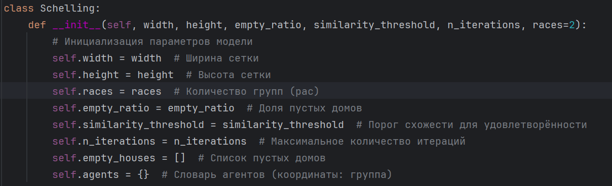
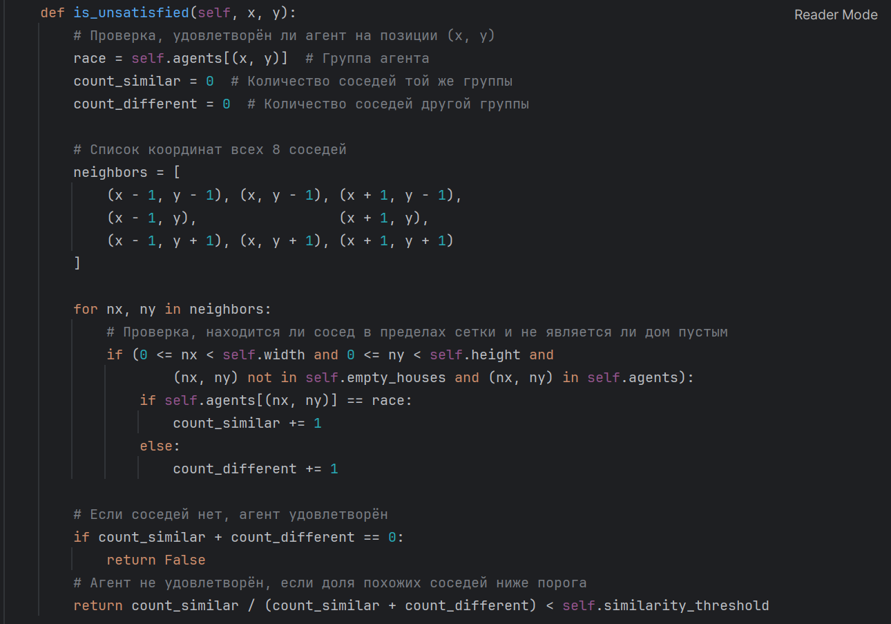
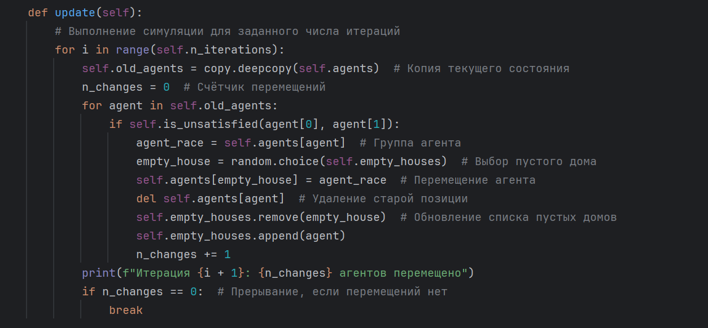
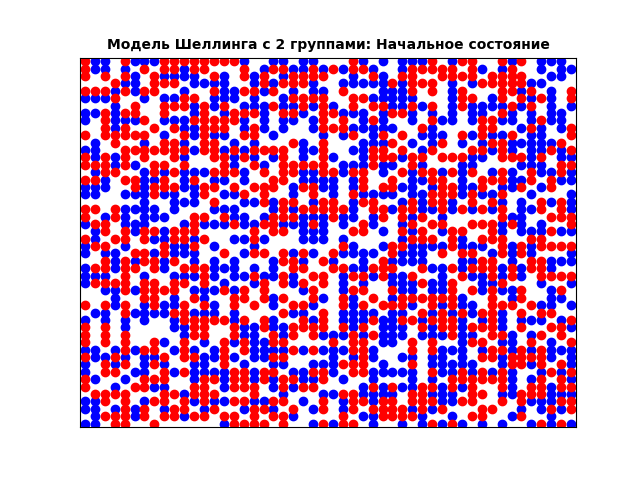
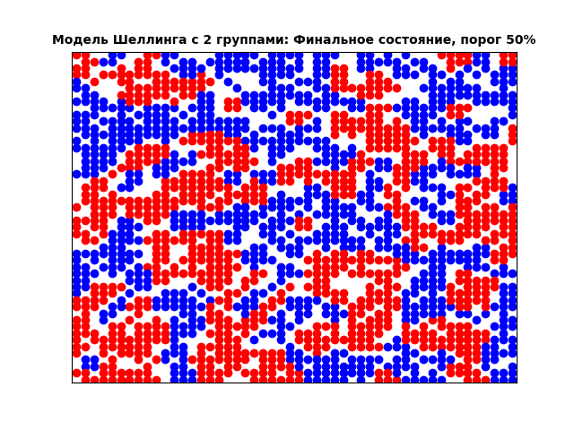
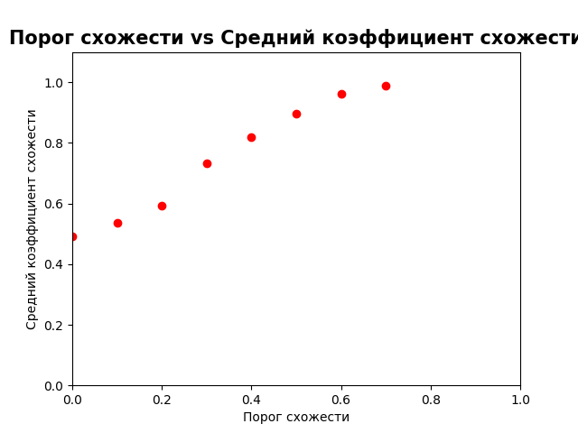

---
## Front matter
lang: ru-RU
title: Доклад Модель сегрегации Шеллинга
subtitle: Математическое моделирование
author:
  - Боровиков Д.А.
institute:
  - Российский университет дружбы народов им. Патриса Лумумбы, Москва, Россия

## i18n babel
babel-lang: russian
babel-otherlangs: english

## Formatting pdf
toc: false
toc-title: Содержание
slide_level: 2
aspectratio: 169
section-titles: true
theme: metropolis
header-includes:
 - \metroset{progressbar=frametitle,sectionpage=progressbar,numbering=fraction}
 - '\makeatletter'
 - '\beamer@ignorenonframefalse'
 - '\makeatother'

## Fonts
mainfont: Arial
romanfont: Arial
sansfont: Arial
monofont: Arial
---

## Докладчик

  * Боровиков Даниил Александрович
  * НПИбд-01-22
  * Российский университет дружбы народов
  * [1132222006@pfur.ru]

## Введение

В данном докладе мы познакомимся с возможностями агентных моделей, которые используются для понимания сложных явлений. Для этого мы воспользуемся Python и моделью Шеллинга.

## Модель сегрегации Шеллинга 
— это агентная модель, разработанная экономистом Томасом Шеллингом. Модель Шеллинга не включает внешние факторы, которые оказывают давление на агентов с целью сегрегации, но работа Шеллинга демонстрирует, что наличие людей с "умеренным" внутригрупповым предпочтением по отношению к своей собственной группе все еще может привести к сильно сегрегированному обществу через фактическую сегрегацию. 

## Модель сегрегации Шеллинга

В агентно-ориентированных моделях есть три параметра: 1) агенты, 2) поведение (правила) и 3) показатели на агрегированном уровне. В модели Шеллинга агентами являются люди, живущие в городе, поведением — переезд в другой район в зависимости от коэффициента сходства, а показателями на агрегированном уровне — коэффициент сходства.

## Python-реализация модели Шеллинга

{#fig:001 width=50%}

## Python-реализация модели Шеллинга

{#fig:002 width=50%}

## Python-реализация модели Шеллинга

{#fig:003 width=50%}

## Модель Шеллинга

{#fig:004 width=50%}

## Модель Шеллинга

{#fig:005 width=50%}

## Модель Шеллинга

{#fig:006 width=50%}

## Модель Шеллинга

{#fig:007 width=50%}

## Значение сегрегации

{#fig:008 width=50%}

## Вывод

Мы рассмотрели один пример агентных моделей под названием «Модель сегрегации Шеллинга» и реализовали её на Python. Эта очень простая модель помогла нам понять очень сложное явление, а именно сегрегацию в многонациональных городах. Мы смогли показать, что очень высокий уровень сегрегации в этих городах не обязательно приводит к нетерпимости на индивидуальном уровне.
