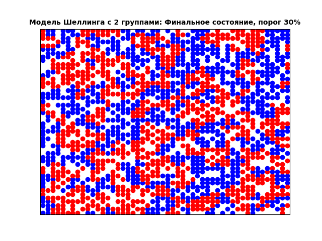
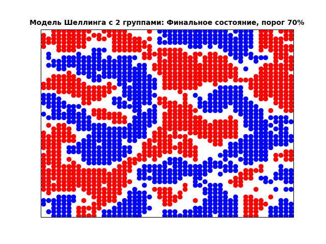

---
## Front matter
title: "Отчёт по докладу Модель сегрегации Шеллинга"
subtitle: "Дисциплина: Математическое моделирование"
author: "Боровиков Даниил Александрович НПИбд-01-22"

## Generic otions
lang: ru-RU
toc-title: "Содержание"

## Bibliography
bibliography: bib/cite.bib
csl: pandoc/csl/gost-r-7-0-5-2008-numeric.csl

## Pdf output format
toc: true # Table of contents
toc-depth: 2
lof: true # List of figures
lot: true # List of tables
fontsize: 12pt
linestretch: 1.5
papersize: a4
documentclass: scrreprt
## I18n polyglossia
polyglossia-lang:
  name: russian
polyglossia-otherlangs:
  name: english
## I18n babel
babel-lang: russian
babel-otherlangs: english
## Fonts
mainfont: Arial
romanfont: Arial
sansfont: Arial
monofont: Arial
mainfontoptions: Ligatures=TeX
romanfontoptions: Ligatures=TeX
sansfontoptions: Ligatures=TeX,Scale=MatchLowercase
monofontoptions: Scale=MatchLowercase,Scale=0.9
## Biblatex
biblatex: true
biblio-style: "gost-numeric"
biblatexoptions:
  - parentracker=true
  - backend=biber
  - hyperref=auto
  - language=auto
  - autolang=other*
  - citestyle=gost-numeric
## Pandoc-crossref LaTeX customization
figureTitle: "Рис."
tableTitle: "Таблица"
listingTitle: "Листинг"
lofTitle: "Список иллюстраций"
lotTitle: "Список таблиц"
lolTitle: "Листинги"
## Misc options
indent: true
header-includes:
  - \usepackage{indentfirst}
  - \usepackage{float} # keep figures where there are in the text
  - \floatplacement{figure}{H} # keep figures where there are in the text
---

# Цель работы

Решить проблему математической модели сегрегации Шеллинга.

# Введение

В информатике агентные модели используются для оценки влияния автономных агентов (то есть отдельных лиц, групп или объектов) на систему в целом. Это очень мощные аналитические инструменты, которые можно использовать в ситуациях, когда проведение экспериментов нецелесообразно или очень дорого. Эти модели имеют широкий спектр применения в социальных науках, информатике, экономике и бизнесе.

В данном докладе мы познакомимся с возможностями агентных моделей, которые используются для понимания сложных явлений. Для этого мы воспользуемся Python и моделью Шеллинга.

# Модель сегрегации Шеллинга

Модель сегрегации Шеллинга — это агентная модель, разработанная экономистом Томасом Шеллингом. Модель Шеллинга не включает внешние факторы, которые оказывают давление на агентов с целью сегрегации, но работа Шеллинга демонстрирует, что наличие людей с "умеренным" внутригрупповым предпочтением по отношению к своей собственной группе все еще может привести к сильно сегрегированному обществу через фактическую сегрегацию. [@wiki:bash].

В агентно-ориентированных моделях есть три параметра: 1) агенты, 2) поведение (правила) и 3) показатели на агрегированном уровне. В модели Шеллинга агентами являются люди, живущие в городе, поведением — переезд в другой район в зависимости от коэффициента сходства, а показателями на агрегированном уровне — коэффициент сходства.

Пусть n — количество рас, проживающих в городе. Мы обозначаем каждую расу уникальным цветом, а город — сеткой, в которой каждая ячейка обозначает дом. Дом может быть пустым или полным. В полном доме может жить только один человек. Если дом пуст, мы закрашиваем его белым цветом. Если дом полон, мы закрашиваем его цветом человека, живущего в нём. Мы определяем соседей человека как людей, живущих в соседних домах (выше, ниже, слева, справа, выше-слева, выше-справа, ниже-слева, ниже-справа).

Цель Шеллинга состояла в том, чтобы проверить, что произойдёт, если люди будут отдавать небольшое предпочтение соседям своего цвета кожи (или даже предпочтут некоторое разнообразие). Если соотношение соседей одной расы превышает определённый порог (который мы называем порогом сходства), мы говорим, что человек удовлетворён. Если нет, мы говорим, что человек неудовлетворён.

Моделирование Шеллинга происходит следующим образом. Мы начинаем со случайного размещения людей в городе и оставляем некоторые дома пустыми. Для каждого человека, живущего в городе, мы проверяем, доволен ли он. Если доволен, мы ничего не делаем. Если нет, мы переселяем человека в пустой дом. Мы запускаем это моделирование на несколько итераций и проверяем итоговое распределение людей. [@tanenbaum_book_modern-os_ru].


# Python-реализация модели Шеллинга

```
import matplotlib.pyplot as plt
import itertools
import random
import copy

class Schelling:
    def __init__(self, width, height, empty_ratio, similarity_threshold, n_iterations, races=2):
        # Инициализация параметров модели
        self.width = width  # Ширина сетки
        self.height = height  # Высота сетки
        self.races = races  # Количество групп (рас)
        self.empty_ratio = empty_ratio  # Доля пустых домов
        self.similarity_threshold = similarity_threshold  # Порог схожести для удовлетворённости
        self.n_iterations = n_iterations  # Максимальное количество итераций
        self.empty_houses = []  # Список пустых домов
        self.agents = {}  # Словарь агентов (координаты: группа)

    def populate(self):
        # Создание списка всех домов и их случайное перемешивание
        self.all_houses = list(itertools.product(range(self.width), range(self.height)))
        random.shuffle(self.all_houses)

        # Определение количества пустых домов
        self.n_empty = int(self.empty_ratio * len(self.all_houses))
        self.empty_houses = self.all_houses[:self.n_empty]

        # Распределение оставшихся домов между группами
        self.remaining_houses = self.all_houses[self.n_empty:]
        houses_by_race = [self.remaining_houses[i::self.races] for i in range(self.races)]
        for i in range(self.races):
            # Добавление агентов каждой группы в словарь
            self.agents.update({house: i + 1 for house in houses_by_race[i]})

    def is_unsatisfied(self, x, y):
        # Проверка, удовлетворён ли агент на позиции (x, y)
        race = self.agents[(x, y)]  # Группа агента
        count_similar = 0  # Количество соседей той же группы
        count_different = 0  # Количество соседей другой группы

        # Список координат всех 8 соседей
        neighbors = [
            (x - 1, y - 1), (x, y - 1), (x + 1, y - 1),
            (x - 1, y),                 (x + 1, y),
            (x - 1, y + 1), (x, y + 1), (x + 1, y + 1)
        ]

        for nx, ny in neighbors:
            # Проверка, находится ли сосед в пределах сетки и не является ли дом пустым
            if (0 <= nx < self.width and 0 <= ny < self.height and
                    (nx, ny) not in self.empty_houses and (nx, ny) in self.agents):
                if self.agents[(nx, ny)] == race:
                    count_similar += 1
                else:
                    count_different += 1

        # Если соседей нет, агент удовлетворён
        if count_similar + count_different == 0:
            return False
        # Агент не удовлетворён, если доля похожих соседей ниже порога
        return count_similar / (count_similar + count_different) < self.similarity_threshold

    def update(self):
        # Выполнение симуляции для заданного числа итераций
        for i in range(self.n_iterations):
            self.old_agents = copy.deepcopy(self.agents)  # Копия текущего состояния
            n_changes = 0  # Счётчик перемещений
            for agent in self.old_agents:
                if self.is_unsatisfied(agent[0], agent[1]):
                    agent_race = self.agents[agent]  # Группа агента
                    empty_house = random.choice(self.empty_houses)  # Выбор пустого дома
                    self.agents[empty_house] = agent_race  # Перемещение агента
                    del self.agents[agent]  # Удаление старой позиции
                    self.empty_houses.remove(empty_house)  # Обновление списка пустых домов
                    self.empty_houses.append(agent)
                    n_changes += 1
            print(f"Итерация {i + 1}: {n_changes} агентов перемещено")
            if n_changes == 0:  # Прерывание, если перемещений нет
                break

    def plot(self, title, file_name):
        # Создание визуализации текущего состояния сетки
        fig, ax = plt.subplots()
        # Цвета для групп (до 7 групп)
        agent_colors = {1: 'b', 2: 'r', 3: 'g', 4: 'c', 5: 'm', 6: 'y', 7: 'k'}
        for agent in self.agents:
            # Отрисовка агента с соответствующим цветом
            ax.scatter(agent[0] + 0.5, agent[1] + 0.5, color=agent_colors[self.agents[agent]])

        ax.set_title(title, fontsize=10, fontweight='bold')
        ax.set_xlim([0, self.width])
        ax.set_ylim([0, self.height])
        ax.set_xticks([])
        ax.set_yticks([])
        plt.savefig(file_name)  # Сохранение графика
        plt.close(fig)  # Закрытие фигуры для предотвращения утечек памяти

    def calculate_similarity(self):
        # Вычисление среднего коэффициента схожести для всех агентов
        similarity = []
        for agent in self.agents:
            count_similar = 0  # Количество соседей той же группы
            count_different = 0  # Количество соседей другой группы
            x, y = agent
            race = self.agents[(x, y)]

            # Список координат всех 8 соседей
            neighbors = [
                (x - 1, y - 1), (x, y - 1), (x + 1, y - 1),
                (x - 1, y),                 (x + 1, y),
                (x - 1, y + 1), (x, y + 1), (x + 1, y + 1)
            ]

            for nx, ny in neighbors:
                # Проверка, находится ли сосед в пределах сетки и не является ли дом пустым
                if (0 <= nx < self.width and 0 <= ny < self.height and
                        (nx, ny) not in self.empty_houses and (nx, ny) in self.agents):
                    if self.agents[(nx, ny)] == race:
                        count_similar += 1
                    else:
                        count_different += 1

            # Вычисление коэффициента схожести
            if count_similar + count_different > 0:
                similarity.append(float(count_similar) / (count_similar + count_different))
            else:
                similarity.append(0)  # Если соседей нет, коэффициент 0

        # Возврат среднего коэффициента схожести
        return sum(similarity) / len(similarity) if similarity else 0

# Инициализация трёх симуляций с разными порогами схожести
schelling_1 = Schelling(50, 50, 0.3, 0.3, 500, 2)
schelling_1.populate()

schelling_2 = Schelling(50, 50, 0.3, 0.5, 500, 2)
schelling_2.populate()

schelling_3 = Schelling(50, 50, 0.3, 0.7, 500, 2)
schelling_3.populate()

# Сохранение начального состояния
schelling_1.plot('Модель Шеллинга с 2 группами: Начальное состояние', 'schelling_2_initial.png')

# Запуск симуляций
schelling_1.update()
schelling_2.update()
schelling_3.update()

# Сохранение финальных состояний
schelling_1.plot('Модель Шеллинга с 2 группами: Финальное состояние, порог 30%', 'schelling_2_30_final.png')
schelling_2.plot('Модель Шеллинга с 2 группами: Финальное состояние, порог 50%', 'schelling_2_50_final.png')
schelling_3.plot('Модель Шеллинга с 2 группами: Финальное состояние, порог 70%', 'schelling_2_70_final.png')

# Анализ зависимости порога схожести от среднего коэффициента схожести
similarity_threshold_ratio = {}
for i in [0, 0.1, 0.2, 0.3, 0.4, 0.5, 0.6, 0.7]:
    schelling = Schelling(50, 50, 0.3, i, 500, 2)
    schelling.populate()
    schelling.update()
    similarity_threshold_ratio[i] = schelling.calculate_similarity()

# Построение графика зависимости
fig, ax = plt.subplots()
plt.plot(list(similarity_threshold_ratio.keys()), list(similarity_threshold_ratio.values()), 'ro')
ax.set_title('Порог схожести vs Средний коэффициент схожести', fontsize=15, fontweight='bold')
ax.set_xlim([0, 1])
ax.set_ylim([0, 1.1])
ax.set_xlabel("Порог схожести")
ax.set_ylabel("Средний коэффициент схожести")
plt.savefig('schelling_segregation_measure.png')
plt.close(fig)  # Закрытие фигуры

```


 Ниже представлен результат работы нашей программы (рис. [-@fig:001]) (рис. [-@fig:002]). (рис. [-@fig:003]).  (рис. [-@fig:004]). 


{ #fig:001 width=70% }

 

{ #fig:002 width=70% }


{ #fig:003 width=70% }


{ #fig:004 width=70% }


Глядя на приведённые выше графики, мы видим, что чем выше порог сходства, тем более сегрегированным становится город. Кроме того, мы видим, что даже при небольшом пороге сходства мы получаем сегрегированные города. Другими словами, даже если люди очень терпимы (то есть имеют небольшой порог сходства), мы всё равно получаем сегрегацию.

Теперь измерим сегрегацию, для этого мы вычислим среднее значение коэффициента сходства для разных порогов сходства и построим график зависимости между порогом сходства и коэффициентом сходства.

(рис. [-@fig:005]). 

{ #fig:005 width=70% }

Из приведённого выше графика видно, что при очень низких пороговых значениях сходства мы получаем очень высокую степень сегрегации (определяемую средним коэффициентом сходства). Например, при пороговом значении сходства 0,3 мы получили средний коэффициент сходства 0,75.

# Выводы

Мы рассмотрели один пример агентных моделей под названием «Модель сегрегации Шеллинга» и реализовали её на Python. Эта очень простая модель помогла нам понять очень сложное явление, а именно сегрегацию в многонациональных городах. Мы смогли показать, что очень высокий уровень сегрегации в этих городах не обязательно приводит к нетерпимости на индивидуальном уровне.

# Список литературы{.unnumbered}

::: {#refs}
:::

