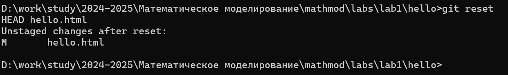
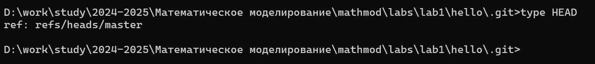

---
## Front matter
lang: ru-RU
title: Лабораторная Работа №1. Работа с git
subtitle: Математическое моделирование
author:
  - Боровиков Д.А.
institute:
  - Российский университет дружбы народов им. Патриса Лумумбы, Москва, Россия

## i18n babel
babel-lang: russian
babel-otherlangs: english

## Formatting pdf
toc: false
toc-title: Содержание
slide_level: 2
aspectratio: 169
section-titles: true
theme: metropolis
header-includes:
 - \metroset{progressbar=frametitle,sectionpage=progressbar,numbering=fraction}
 - '\makeatletter'
 - '\beamer@ignorenonframefalse'
 - '\makeatother'

## Fonts
mainfont: Arial
romanfont: Arial
sansfont: Arial
monofont: Arial
---

## Докладчик

  * Боровиков Даниил Александрович
  * НПИбд-01-22
  * Российский университет дружбы народов
  * [1132222006@pfur.ru]

## Цели и задачи

Приобрести практические навыки работы с git и разобрать основные его особенности.

## Параметры установки окончаний строк  

{#fig:001 width=50%}  

## Установка отображения unicode  

{#fig:002 width=50%}  

## Создание страницы «Hello, World» 
 
{#fig:003 width=50%}  

## Создание репозитория  

{#fig:004 width=50%}  

## Добавление файла в репозиторий  

{#fig:005 width=50%}  

## Проверка состояние репозитория  

{#fig:006 width=50%}  

## Изменение содержимого файла hello.html  

{#fig:007 width=50%}  

## Проверка состояния рабочего каталога  

{#fig:008 width=50%}  

## Индексация изменений  

{#fig:009 width=50%}  

## Добавление комментария, сохранение файла и выход из редактора  

{#fig:010 width=50%}  

## Повторная проверка состояния  

{#fig:011 width=50%}  

## Изменение страницы «Hello, World»  

{#fig:012 width=50%}  

## Добавление изменения в индекс git  

{#fig:013 width=50%}  

## Добавление заголовков HTML к странице «Hello, World»  

{#fig:014 width=50%}  

## Добавление стандартных тегов страницы  

{#fig:015 width=50%}  

## История  

{#fig:016 width=50%}  

## Получение старых версий  

{#fig:017 width=50%}  

## Создание тегов версий  

{#fig:018 width=50%}  

## Переключение по имени тега  

{#fig:019 width=50%}  

## Просмотр тегов с помощью команды tag  

{#fig:020 width=50%}  

## Переключитесь на ветку master  

{#fig:021 width=50%}  

## Изменение hello.html  

{#fig:022 width=50%}  

## Проверка состояния  

{#fig:023 width=50%}  

## Отмена изменений в рабочем каталоге  

{#fig:024 width=50%}  

## Внесение изменения в файл hello.html  

{#fig:025 width=50%}  

## Индексация изменения  

{#fig:026 width=50%}  

## Проверка состояния  

{#fig:027 width=50%}  

## Выполнение сброса буферной зоны  

{#fig:028 width=50%}  

## Переключение на версию коммита  

{#fig:029 width=50%}  

## Изменение файла hello.html  

{#fig:030 width=50%}  

## Коммит  

{#fig:031 width=50%}  

## Создание коммита с новыми изменениями, отменяющими предыдущие  

{#fig:032 width=50%}  

## Проверка лога  

{#fig:033 width=50%}  

## Проверка нашей истории  

{#fig:034 width=50%}  

## Отметка этой ветки для начала  

{#fig:035 width=50%}  

## Сброс коммитов к предшествующим коммиту Oops  

{#fig:036 width=50%}  

## Просмотр всех коммитов  

{#fig:037 width=50%}  

## Удаление тега oops  

{#fig:038 width=50%}  

## Добавление в страницу комментария автора  

{#fig:039 width=50%}  

## Коммит  

{#fig:040 width=50%}  

## Добавление email  

{#fig:041 width=50%}  

## Изменение предыдущего коммита  

{#fig:042 width=50%}  

## Просмотр истории  

{#fig:043 width=50%}  

## Перемещение файла hello.html в каталог lib  

{#fig:044 width=50%}  

## Коммит в новом каталоге  

{#fig:045 width=50%}  

## Добавление index.html  

{#fig:046 width=50%}  

## Каталог .git  

{#fig:047 width=50%}  

## Просмотр базы данных объектов  

{#fig:048 width=50%}  

## Углубление в базу данных объектов  

{#fig:049 width=50%}  

## Просмотр Config File  

{#fig:050 width=50%}  

## Изучение веток и тегов  

{#fig:051 width=50%}  

## Файл HEAD  

{#fig:052 width=50%}  

## Поиск последнего коммита  

{#fig:053 width=50%}  

## Вывод последнего коммита с помощью SHA1 хэша  

{#fig:054 width=50%}  

## Поиск дерева  

{#fig:055 width=50%}  

## Вывод каталога lib  

{#fig:056 width=50%}  

## Вывод файла hello.html  

{#fig:057 width=50%}  

## Создание ветки  

{#fig:058 width=50%}  

## Создание файла css  

{#fig:059 width=50%}  

## Добавление содержимого в файл  

{#fig:060 width=50%}  

## Коммит  

{#fig:061 width=50%}  

## Обновление файла hello.html  

{#fig:062 width=50%}  

## Коммит  

{#fig:063 width=50%}  

## Обновление файла index.html  

{#fig:064 width=50%}  

## Коммит  

{#fig:065 width=50%}  

## Навигация по веткам  

{#fig:066 width=50%}  

## Переключение на ветку master  

{#fig:067 width=50%}  

## Переключение на ветку style  

{#fig:068 width=50%}  

## Создание файла README.md  

{#fig:069 width=50%}  

## Коммит изменений README.md в ветку master  

{#fig:070 width=50%}  

## Просмотр текущих веток  

{#fig:071 width=50%}  

## Слияние веток  

{#fig:072 width=50%}  

## Возвращение в ветку master  

{#fig:073 width=50%}  

## Внесение изменений в файл  

{#fig:074 width=50%}  

## Коммит  

{#fig:075 width=50%}  

## Просмотр веток  

{#fig:076 width=50%}  

## Попытка объединения  

{#fig:077 width=50%}  

## Решение конфликта  

{#fig:078 width=50%}  

## Коммит решения конфликта  

{#fig:079 width=50%}  

## Возвращение на ветку style  

{#fig:080 width=50%}  

## Сброс ветки style к нужному коммиту  

{#fig:081 width=50%}  

## Проверка ветки  

{#fig:082 width=50%}  

## Сброс ветки master  

{#fig:083 width=50%}  

## Перебазирование  

{#fig:084 width=50%}  

## Слияние style в master 
 
{#fig:085 width=50%}  

## Просмотр логов  

{#fig:086 width=50%}  

## Клонирование репозиториев  

{#fig:087 width=50%}  

## Создание клона репозитория hello  

{#fig:088 width=50%}  

## Просмотр клонированного репозитория 
 
{#fig:089 width=50%}  

## Просмотр истории репозитория  

{#fig:090 width=50%}  

## Изучение origin  

{#fig:091 width=50%}  

## Просмотр доступных веток в клонированном репозитории  

{#fig:092 width=50%}  

## Просмотр всех веток  

{#fig:093 width=50%}  

## Переход в репозиторий hello  

{#fig:094 width=50%}  

## Внесение изменения в файл README.md  

{#fig:095 width=50%}  

## Добавление изменения и создание коммита  

{#fig:096 width=50%}  

## Извлечение изменений  

{#fig:097 width=50%}  

## Проверка README.md  

{#fig:098 width=50%}  

## Слив извлеченных изменений в локальную ветку master  

{#fig:099 width=50%}  

## Объединение fetch и merge в одну команду  

{#fig:100 width=50%}  

## Добавление локальной ветки, которая отслеживает удаленную ветку  

{#fig:101 width=50%}  

## Создание чистого репозитория  

{#fig:102 width=50%}  

## Добавление удаленного репозитория  

{#fig:103 width=50%}  

## Редактирование файла README.md  

{#fig:104 width=50%}  

## Коммит и отправка изменений в общий репозиторий  

{#fig:105 width=50%}  

## Извлечение общих изменений  

{#fig:106 width=50%}

## Вывод

Я приобрел навыки работы с git и разобрал основные его особенности.