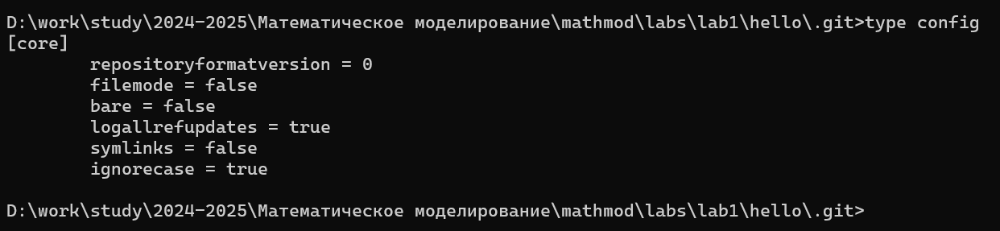

---
## Front matter
title: "Отчёт по лабораторной работе №1"
subtitle: "Дисциплина: Математическое моделирование"
author: "Боровиков Даниил Александрович НПИбд-01-22"

## Generic otions
lang: ru-RU
toc-title: "Содержание"

## Bibliography
bibliography: bib/cite.bib
csl: pandoc/csl/gost-r-7-0-5-2008-numeric.csl

## Pdf output format
toc: true # Table of contents
toc-depth: 2
lof: true # List of figures
lot: true # List of tables
fontsize: 12pt
linestretch: 1.5
papersize: a4
documentclass: scrreprt
## I18n polyglossia
polyglossia-lang:
  name: russian
polyglossia-otherlangs:
  name: english
## I18n babel
babel-lang: russian
babel-otherlangs: english
## Fonts
mainfont: Arial
romanfont: Arial
sansfont: Arial
monofont: Arial
mainfontoptions: Ligatures=TeX
romanfontoptions: Ligatures=TeX
sansfontoptions: Ligatures=TeX,Scale=MatchLowercase
monofontoptions: Scale=MatchLowercase,Scale=0.9
## Biblatex
biblatex: true
biblio-style: "gost-numeric"
biblatexoptions:
  - parentracker=true
  - backend=biber
  - hyperref=auto
  - language=auto
  - autolang=other*
  - citestyle=gost-numeric
## Pandoc-crossref LaTeX customization
figureTitle: "Рис."
tableTitle: "Таблица"
listingTitle: "Листинг"
lofTitle: "Список иллюстраций"
lotTitle: "Список таблиц"
lolTitle: "Листинги"
## Misc options
indent: true
header-includes:
  - \usepackage{indentfirst}
  - \usepackage{float} # keep figures where there are in the text
  - \floatplacement{figure}{H} # keep figures where there are in the text
---

# Цель работы

Приобрести практические навыки работы с git и разобрать основные его особенности.

# Выполнение лабораторной работы

 Для начала установим параметры окончаний строк (рис. [-@fig:001]).

{#fig:001 width=100%}

По умолчанию, git будет печатать не-ASCII символов в именах файлов в виде
восьмеричных последовательностей. Что бы избежать нечитаемых строк,
установим соответствующий флаг (рис. [-@fig:002]).

{#fig:002 width=100%}

Начнём работу в пустом рабочем каталоге с создания пустого каталога с именем
hello, затем войдём в него и создадим там файл с именем hello.html (рис. [-@fig:003]).

{#fig:003 width=100%}

Чтобы создать git репозиторий из этого каталога, выполним команду git init (рис. [-@fig:004]).

{#fig:004 width=100%}

Добавим файл в репозиторий (рис. [-@fig:005]).

{#fig:005 width=100%}

Используем команду git status, чтобы проверить текущее состояние репозитория (рис. [-@fig:006]).

{#fig:006 width=100%}

Добавим кое-какие HTML-теги к нашему приветствию. Изменим содержимое
файла hello.html (рис. [-@fig:007]).

{#fig:007 width=100%}

Проверим состояние рабочего каталога (рис. [-@fig:008]).

{#fig:008 width=100%}

Теперь выполним команду git, чтобы проиндексировать изменения. Проверим
состояние (рис. [-@fig:009]).

{#fig:009 width=100%}

Сделаем коммит и проверим состояние. Откроется редактор.
В первой строке введём комментарий: «Added h1 tag». Сохраним файл и выйдем из редактора (рис. [-@fig:010]).

{#fig:010 width=100%}

Теперь еще раз проверим состояние (рис. [-@fig:011]).

{#fig:011 width=100%}

Изменим страницу «Hello, World», чтобы она содержала стандартные теги <html>
и <body> (рис. [-@fig:012]).

{#fig:012 width=100%}

Теперь добавим это изменение в индекс git (рис. [-@fig:013]).

{#fig:013 width=100%}

Теперь добавим заголовки HTML (секцию <head>) к странице «Hello, World» (рис. [-@fig:014]).

{#fig:014 width=100%}

Проверим текущий статус. Произведём коммит проиндексированного изменения (значение по умолчанию), а затем еще раз проверим состояние.
Далее добавим второе изменение в индекс, а затем проверим состояние с помощью команды git status и сделаем коммит второго изменения (рис. [-@fig:015]).

{#fig:015 width=100%}

Получим список произведенных изменений различными способами (рис. [-@fig:016]).

{#fig:016 width=100%}

Получим хэши предыдущих версий. Затем проверим содержимое файла hello.html и вернёмся к последней версии в ветке master (рис. [-@fig:017]).

{#fig:017 width=100%}

Создадим тег первой версии. Далее переключимся на предыдущую версию. Это версия c тегами <html> и <body>, но еще пока без <head>. Давайте сделаем
ее версией v1-beta (рис. [-@fig:018]).

{#fig:018 width=100%}

Теперь попробуем попереключаться между двумя отмеченными версиями (рис. [-@fig:019]).

{#fig:019 width=100%}

Мы можем увидеть, какие теги доступны, используя команду git tag и также можем посмотреть теги в логе (рис. [-@fig:020]).

{#fig:020 width=100%}

Убедимся, что мы находимся на последнем коммите ветки master, прежде чем продолжить работу (рис. [-@fig:021]).

{#fig:021 width=100%}

Внесём изменение в файл hello.html в виде нежелательного комментария (рис. [-@fig:022]).

{#fig:022 width=100%}

Сначала проверим состояние рабочего каталога (рис. [-@fig:023]).

{#fig:023 width=100%}

Используем команду git checkout для переключения версии файла hello.html в репозитории (рис. [-@fig:024]).

{#fig:024 width=100%}

Внесём изменение в файл hello.html в виде нежелательного комментария (рис. [-@fig:025]).

{#fig:025 width=100%}

Проиндексируем это изменение (рис. [-@fig:026]).

{#fig:026 width=100%}

Проверим состояние нежелательного изменения (рис. [-@fig:027]).

{#fig:027 width=100%}

К счастью, вывод состояния показывает нам именно то, что мы должны сделать для отмены индексации изменения (рис. [-@fig:028]).

{#fig:028 width=100%}

Переключимся на версию коммита (рис. [-@fig:029]).

{#fig:029 width=100%}

Изменим файл hello.html (рис. [-@fig:030]).

{#fig:030 width=100%}

Далее сделаем коммит (рис. [-@fig:031]).

{#fig:031 width=100%}

Чтобы отменить коммит, нам необходимо сделать коммит, который удаляет изменения, сохраненные нежелательным коммитом (рис. [-@fig:032]).

{#fig:032 width=100%}

Проверка лога показывает нежелательные и отмененные коммиты в наш репозиторий (рис. [-@fig:033]).

{#fig:033 width=100%}

Сделаем быструю проверку нашей истории коммитов (рис. [-@fig:034]).

{#fig:034 width=100%}

Но прежде чем удалить коммиты, давайте отметим последний коммит тегом, чтобы потом можно было его найти (рис. [-@fig:035]).

{#fig:035 width=100%}

Глядя на историю лога, мы видим, что коммит с тегом «v1» является коммитом,
предшествующим ошибочному коммиту. Давайте сбросим ветку до этой точки.
Поскольку ветка имеет тег, мы можем использовать имя тега в команде сброса
(если она не имеет тега, мы можем использовать хэш-значение) (рис. [-@fig:036]).

{#fig:036 width=100%}

Что же случается с ошибочными коммитами? Оказывается, что коммиты все еще
находятся в репозитории. На самом деле, мы все еще можем на них ссылаться.
Помните, в начале этого урока мы создали для отмененного коммита тег «oops».
Давайте посмотрим на все коммиты (рис. [-@fig:037]).

{#fig:037 width=100%}

Тег oops свою функцию выполнил. Давайте удалим его и коммиты, на которые он
ссылался, сборщиком мусора (рис. [-@fig:038]).

{#fig:038 width=100%}

Добавим в страницу комментарий автора (вставим свою фамилию) (рис. [-@fig:039]).

{#fig:039 width=100%}

После чего выполним коммит (рис. [-@fig:040]).

{#fig:040 width=100%}

После совершения коммита мы понимаем, что любой хороший комментарий должен включать электронную почту автора. Обновим страницу hello, включив в
нее email (рис. [-@fig:041]).

{#fig:041 width=100%}

Мы действительно не хотим создавать отдельный коммит только ради электронной
почты. Давайте изменим предыдущий коммит, включив в него адрес электронной
почты (рис. [-@fig:042]).

{#fig:042 width=100%}

Просмотрим историю (рис. [-@fig:043]).

{#fig:043 width=100%}

Сейчас мы собираемся создать структуру нашего репозитория. Давайте перенесем
страницу в каталог lib (рис. [-@fig:044]).

{#fig:044 width=100%}

Давайте сделаем коммит этого перемещения (рис. [-@fig:045]).

{#fig:045 width=100%}

Добавим файл index.html в наш репозиторий, добавим содержимое в файл и сделаем коммит (рис. [-@fig:046]).

{#fig:046 width=100%}

Просмотрим каталог, в котором хранится вся информация git (рис. [-@fig:047]).

{#fig:047 width=100%}

Далее просмотрим набор каталогов, имена которых состоят из 2 символов. Имена каталогов являются первыми двумя буквами хэша sha1 объекта, хранящегося в
git (рис. [-@fig:048]).

{#fig:048 width=100%}

Осмотрим один из каталогов с именем из 2 букв. Мы видим файлы с именами
из 38 символов. Это файлы, содержащие объекты, хранящиеся в git. Они сжаты и
закодированы, поэтому просмотр их содержимого нам мало чем поможет (рис. [-@fig:049]).

{#fig:049 width=100%}

Изучим файл конфигурации, создающийся для каждого конкретного проекта. Записи
в этом файле будут перезаписывать записи в файле .gitconfig нашего главного
каталога, по крайней мере в рамках этого проекта (рис. [-@fig:050]).

{#fig:050 width=100%}

Выполним набор команд для папки .git (рис. [-@fig:051]).

{#fig:051 width=100%}

Файл HEAD содержит ссылку на текущую ветку, в данный момент это должна
быть ветка master (рис. [-@fig:052]).

{#fig:052 width=100%}

Эта команда показывает последний коммит в репозиторий (рис. [-@fig:053]).

{#fig:053 width=100%}

Выведем последний коммит с помощью SHA1 хэша (рис. [-@fig:054]).

{#fig:054 width=100%}

Мы можем вывести дерево каталогов, ссылка на который идет в коммите. Это должно быть описание файлов (верхнего уровня) в нашем проекте (для конкретного
коммита). Используем SHA1 хэш из строки «дерева», из списка выше (рис. [-@fig:055]).

{#fig:055 width=100%}

Выведем каталог lib (рис. [-@fig:056]).

{#fig:056 width=100%}

Выведем файл hello.html (рис. [-@fig:057]).

{#fig:057 width=100%}

Давайте назовем нашу новую ветку «style» (рис. [-@fig:058]).

{#fig:058 width=100%}

Создадим файл css (рис. [-@fig:059]).

{#fig:059 width=100%}

Добавим содержимое в файл (рис. [-@fig:060]).

{#fig:060 width=100%}

Выполним коммит (рис. [-@fig:061]).

{#fig:061 width=100%}

Обновим файл hello.html, чтобы использовать стили style.css (рис. [-@fig:062]).

{#fig:062 width=100%}

Выполним коммит (рис. [-@fig:063]).

{#fig:063 width=100%}

Обновим файл index.html, чтобы он тоже использовал style.css (рис. [-@fig:064]).

{#fig:064 width=100%}

Выполним коммит (рис. [-@fig:065]).

{#fig:065 width=100%}

Теперь в нашем проекте есть две ветки (рис. [-@fig:066]).

{#fig:066 width=100%}

Используем команду git checkout для переключения между ветками (рис. [-@fig:067]).

{#fig:067 width=100%}

Вернемся к ветке style (рис. [-@fig:068]).

{#fig:068 width=100%}

Переключимся на ветку master и создадим файл README.md (рис. [-@fig:069]).

{#fig:069 width=100%}

Сделаем коммит изменений README.md в ветку master (рис. [-@fig:070]).

{#fig:070 width=100%}

Просмотрим текущие ветки (рис. [-@fig:071]).

{#fig:071 width=100%}

Слияние переносит изменения из двух веток в одну. Давайте вернемся к веткет style и сольем master с style (рис. [-@fig:072]).

{#fig:072 width=100%}

Вернёмся в ветку master (рис. [-@fig:073]).

{#fig:073 width=100%}

Внесём следующие изменения в файл (рис. [-@fig:074]).

{#fig:074 width=100%}

Выполним коммит (рис. [-@fig:075]).

{#fig:075 width=100%}

Просмотрим ветки (рис. [-@fig:076]).

{#fig:076 width=100%}

Теперь вернемся к ветке style и попытаемся объединить ее с новой веткой
master (рис. [-@fig:077]).

{#fig:077 width=100%}

Нам необходимо вручную разрешить конфликт. Внесём изменения в lib/hello.html
для достижения следующего результата (рис. [-@fig:078]).

{#fig:078 width=100%}

Сделаем коммит решения конфликта (рис. [-@fig:079]).

{#fig:079 width=100%}

Вернемся на ветке style к точке перед тем, как мы слили ее с веткой master. Мы
можем сбросить ветку к любому коммиту. По сути, это изменение указателя ветки на любую точку дерева коммитов. В этом случае мы хотим вернуться в ветке style в точку перед слиянием с master. Нам необходимо найти последний коммит перед слиянием (рис. [-@fig:080]).

{#fig:080 width=100%}

Сбросим ветку style к нужному коммиту (рис. [-@fig:081]).

{#fig:081 width=100%}

Проверим лог ветки style. У нас в истории больше нет коммитов слияний. (рис. [-@fig:082]).

{#fig:082 width=100%}

Сбросим ветку master (рис. [-@fig:083]).

{#fig:083 width=100%}

Используем команду rebase вместо команды merge. Мы вернулись в точку до первого слияния и хотим перенести изменения из ветки master в нашу ветку style. На этот раз для переноса изменений из ветки master мы будем использовать команду git rebase вместо слияния (рис. [-@fig:084]).

{#fig:084 width=100%}

Выполним слияние style в master (рис. [-@fig:085]).

{#fig:085 width=100%}

Просмотрим логи (рис. [-@fig:086]).

{#fig:086 width=100%}

Перейдём в рабочий каталог и сделаем клон нашего репозитория hello (рис. [-@fig:087]).

{#fig:087 width=100%}

Создадим клон репозитория (рис. [-@fig:088]).

{#fig:088 width=100%}

Давайте взглянем на клонированный репозиторий (рис. [-@fig:089]).

{#fig:089 width=100%}

Просмотрим историю репозитория (рис. [-@fig:090]).

{#fig:090 width=100%}

Мы видим, что клонированный репозиторий знает об имени по умолчанию
удаленного репозитория. Давайте посмотрим, можем ли мы получить более подробную информацию об имени по умолчанию (рис. [-@fig:091]).

{#fig:091 width=100%}

Давайте посмотрим на ветки, доступные в нашем клонированном репозитории (рис. [-@fig:092]).

{#fig:092 width=100%}

Для того, чтобы увидеть все ветки, попробуем следующую команду (рис. [-@fig:093]).

{#fig:093 width=100%}

Перейдём в репозиторий hello (рис. [-@fig:094]).

{#fig:094 width=100%}

Внесём изменения в файл README.md (рис. [-@fig:095]).

{#fig:095 width=100%}

Добавим это изменение и сделаем коммит (рис. [-@fig:096]).

{#fig:096 width=100%}

Научимся извлекать изменения из удаленного репозитория (рис. [-@fig:097]).

{#fig:097 width=100%}

Мы можем продемонстрировать, что клонированный файл README.md не изменился (рис. [-@fig:098]).

{#fig:098 width=100%}

Сольём извлеченные изменения в локальную ветку master (рис. [-@fig:099]).

{#fig:099 width=100%}

Теперь давайте рассмотрим объединение fetch и merge в одну команду (рис. [-@fig:100]).

{#fig:100 width=100%}

Добавим локальную ветку, которая отслеживает удаленную ветку (рис. [-@fig:101]).

{#fig:101 width=100%}

Создадим чистый репозиторий (рис. [-@fig:102]).

{#fig:102 width=100%}

Добавим удаленный репозиторий (рис. [-@fig:103]).

{#fig:103 width=100%}

Отредактируем файл README.md (рис. [-@fig:104]).

{#fig:104 width=100%}

Сделаем коммит и отправим изменения в общий репозиторий (рис. [-@fig:105]).

{#fig:105 width=100%}

Научимся извлекать изменения из общего репозитория. Быстро переключимся в
клонированный репозиторий и извлечём изменения, только что отправленные в
общий репозиторий (рис. [-@fig:106]).

{#fig:106 width=100%}

# Выводы

Я приобрел навыки работы с git и разобрал основные его особенности.
