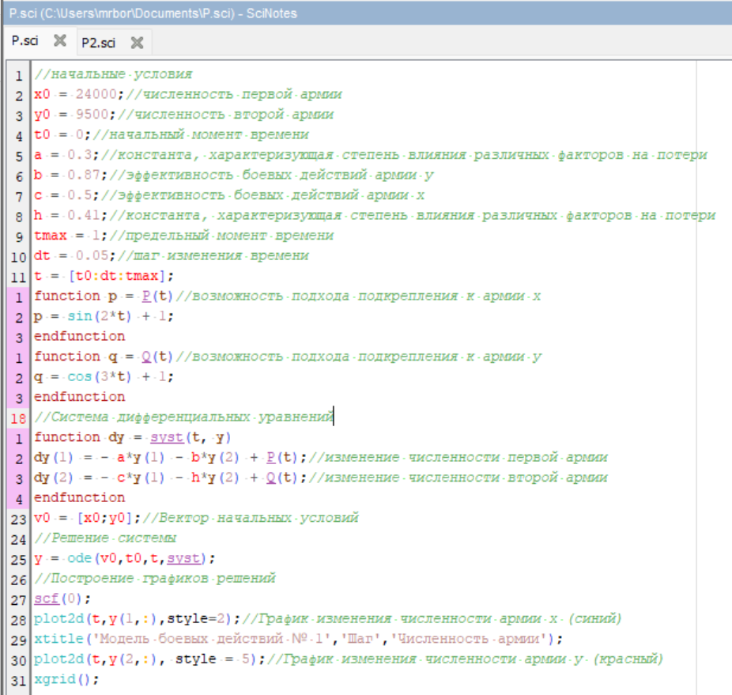
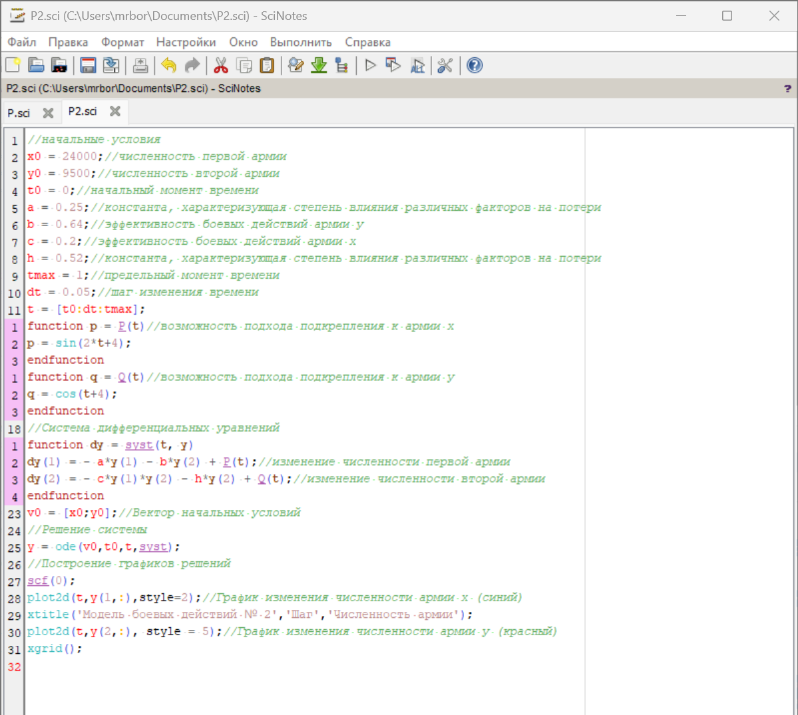

---
## Front matter
lang: ru-RU
title: Лабораторная Работа №3. Модель боевых действий.
subtitle: Математическое моделирование
author:
  - Боровиков Д.А.
institute:
  - Российский университет дружбы народов им. Патриса Лумумбы, Москва, Россия

## i18n babel
babel-lang: russian
babel-otherlangs: english

## Formatting pdf
toc: false
toc-title: Содержание
slide_level: 2
aspectratio: 169
section-titles: true
theme: metropolis
header-includes:
 - \metroset{progressbar=frametitle,sectionpage=progressbar,numbering=fraction}
 - '\makeatletter'
 - '\beamer@ignorenonframefalse'
 - '\makeatother'

## Fonts
mainfont: Arial
romanfont: Arial
sansfont: Arial
monofont: Arial
---

## Докладчик

  * Боровиков Даниил Александрович
  * НПИбд-01-22
  * Российский университет дружбы народов
  * [1132222006@pfur.ru]

## Цели и задачи

Построить графики моделей боевых действий и познакомиться с Scilab. 

## 

Рассмотрим подробнее уравнения

 Потери, не связанные с боевыми действиями, описывают члены -0,3x(t) и -0,41y(t), 
члены -0,87y(t) и -0,5x(t) отражают потери на поле боя. Функции P(t)=sin(2t)+1, Q(t)=cos(3t)+1 учитывают
возможность подхода подкрепления к войскам Х и У в течение одного дня. 

 Потери, не связанные с боевыми действиями, описывают члены -0,25x(t) и -0,52y(t), 
члены -0,64y(t) и -0,2x(t)y(t) отражают потери на поле боя. Функции P(t)=sin(2t+4), Q(t)=cos(t+4) учитывают
возможность подхода подкрепления к войскам Х и У в течение одного дня.
  
Начальные условия для обоих случаев будут равно $x_{0}=24 000$, $y_{0}=9 000$

## Код первой программы

{#fig:001 width=50%}

## График для первого случая

{#fig:002 width=50%}

## Код второй программы

{#fig:003 width=50%}

## График для второго случая

{#fig:004 width=50%}

## Вывод

В ходе выполнения лабороторной работы я приобрел навыки по построению графиков моделей боевых действий и познакомился с Scilab.
