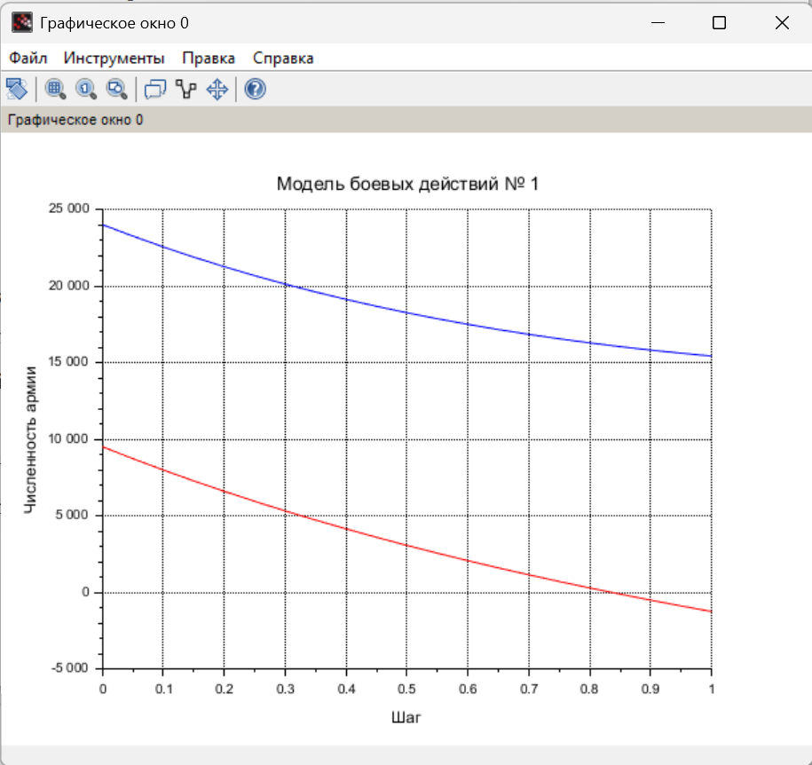
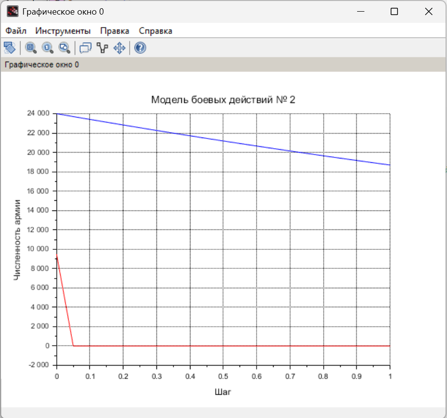

---
## Front matter
title: "Отчёт по лабораторной работе №3"
subtitle: "Дисциплина: Математическое моделирование"
author: "Боровиков Даниил Александрович НПИбд-01-22"

## Generic otions
lang: ru-RU
toc-title: "Содержание"

## Bibliography
bibliography: bib/cite.bib
csl: pandoc/csl/gost-r-7-0-5-2008-numeric.csl

## Pdf output format
toc: true # Table of contents
toc-depth: 2
lof: true # List of figures
lot: true # List of tables
fontsize: 12pt
linestretch: 1.5
papersize: a4
documentclass: scrreprt
## I18n polyglossia
polyglossia-lang:
  name: russian
polyglossia-otherlangs:
  name: english
## I18n babel
babel-lang: russian
babel-otherlangs: english
## Fonts
mainfont: Arial
romanfont: Arial
sansfont: Arial
monofont: Arial
mainfontoptions: Ligatures=TeX
romanfontoptions: Ligatures=TeX
sansfontoptions: Ligatures=TeX,Scale=MatchLowercase
monofontoptions: Scale=MatchLowercase,Scale=0.9
## Biblatex
biblatex: true
biblio-style: "gost-numeric"
biblatexoptions:
  - parentracker=true
  - backend=biber
  - hyperref=auto
  - language=auto
  - autolang=other*
  - citestyle=gost-numeric
## Pandoc-crossref LaTeX customization
figureTitle: "Рис."
tableTitle: "Таблица"
listingTitle: "Листинг"
lofTitle: "Список иллюстраций"
lotTitle: "Список таблиц"
lolTitle: "Листинги"
## Misc options
indent: true
header-includes:
  - \usepackage{indentfirst}
  - \usepackage{float} # keep figures where there are in the text
  - \floatplacement{figure}{H} # keep figures where there are in the text
---

# Цель работы

Построить графики моделей боевых действий и познакомиться с Scilab. 

#  Задание

**Вариант 7**  
  Задача: Между страной Х и страной У идет война. Численность состава войск
исчисляется от начала войны, и являются временными функциями x(t) и y(t). В
начальный момент времени страна Х имеет армию численностью 24 000 человек,
а в распоряжении страны У армия численностью в 9 000 человек. Для упрощения
модели считаем, что коэффициенты a,b,c,h постоянны. 
постоянны. Также считаем P(t) и Q(t) непрерывные функции.
  Постройте графики изменения численности войск армии Х и армии У для
следующих случаев: 

1. Модель боевых действий между регулярными войсками  
  $\frac{\partial x}{\partial t} = -0,3x(t)-0,87y(t)+sin(2t)+1$  
  $\frac{\partial y}{\partial t} = -0,5x(t)-0,41y(t)+cos(3t)+1$

2. Модель ведение боевых действий с участием регулярных войск и
партизанских отрядов  
  $\frac{\partial x}{\partial t} = -0,25x(t)-0,64y(t)+sin(2t+4)$  
  $\frac{\partial y}{\partial t} = -0,2x(t)y(t)-0,52y(t)+cos(t+4)$

# Выполнение лабораторной работы

 Рассмотрим подробнее уравнения

 Потери, не связанные с боевыми действиями, описывают члены -0,3x(t) и -0,41y(t), 
члены -0,87y(t) и -0,5x(t) отражают потери на поле боя. Функции P(t)=sin(2t)+1, Q(t)=cos(3t)+1 учитывают
возможность подхода подкрепления к войскам Х и У в течение одного дня. 

 Потери, не связанные с боевыми действиями, описывают члены -0,25x(t) и -0,52y(t), 
члены -0,64y(t) и -0,2x(t)y(t) отражают потери на поле боя. Функции P(t)=sin(2t+4), Q(t)=cos(t+4) учитывают
возможность подхода подкрепления к войскам Х и У в течение одного дня. [@wiki:bash].
  
Начальные условия для обоих случаев будут равно $x_{0}=24 000$, $y_{0}=9 000$

 Напишем первую программу Scilab (рис. [-@fig:001])

{ #fig:001 width=70% }

При выполнении кода получаем график(рис. [-@fig:002]). 

{ #fig:002 width=70% }

Напишем вторую программу Scilab(рис. [-@fig:003]). 

{ #fig:003 width=70% }

При выполнении кода получаем график(рис. [-@fig:004]). 

{ #fig:004 width=70% }

# Выводы

В ходе выполнения лабороторной работы я приобрел навыки по построению графиков моделей боевых действий и познакомился с Scilab.

# Список литературы{.unnumbered}

::: {#refs}
:::
