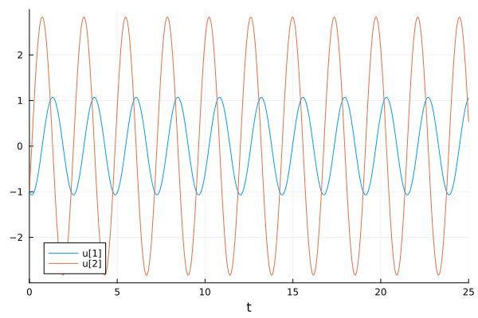
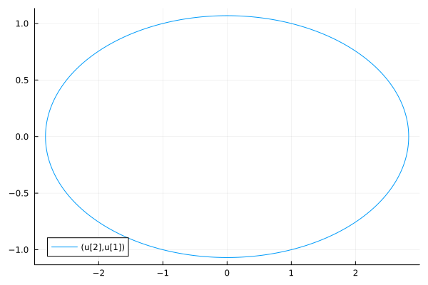
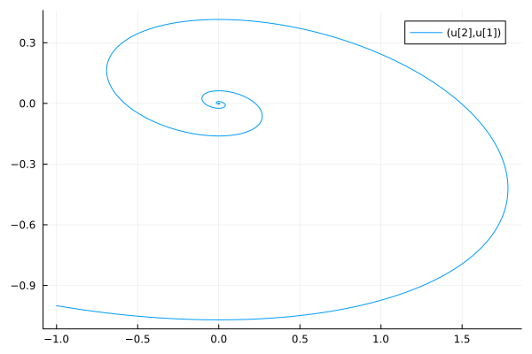
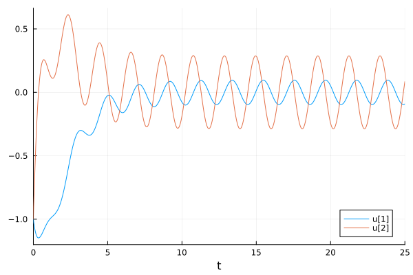
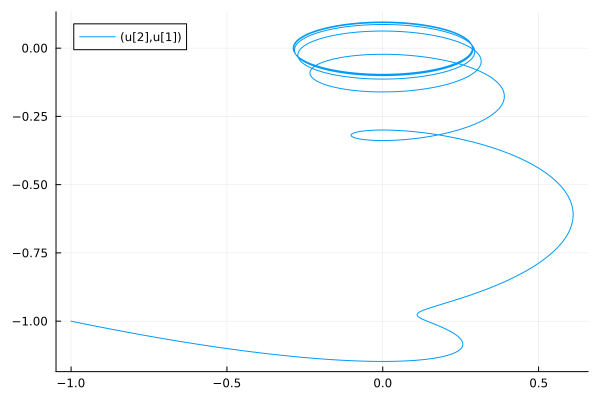
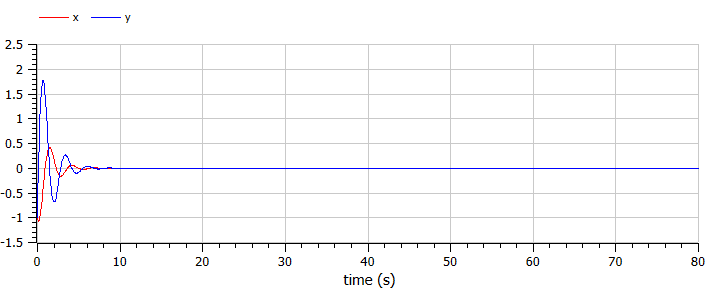
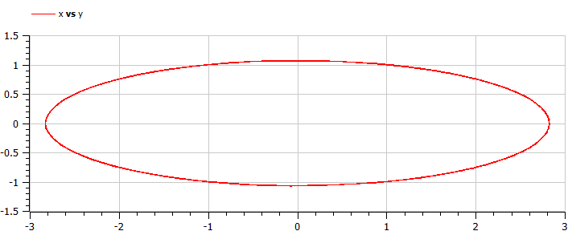
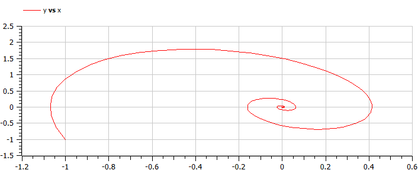
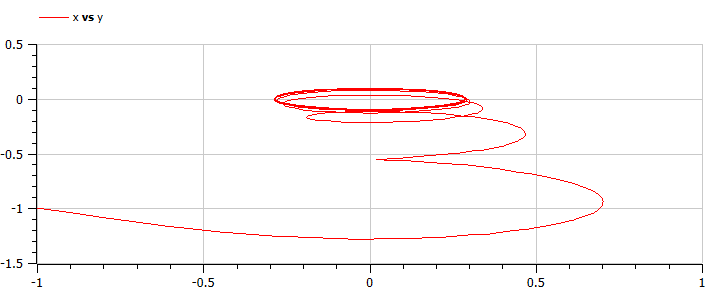

---
## Front matter
title: "Отчёт по лабораторной работе №4"
subtitle: "Дисциплина: Математическое моделирование"
author: "Боровиков Даниил Александрович НПИбд-01-22"

## Generic otions
lang: ru-RU
toc-title: "Содержание"

## Bibliography
bibliography: bib/cite.bib
csl: pandoc/csl/gost-r-7-0-5-2008-numeric.csl

## Pdf output format
toc: true # Table of contents
toc-depth: 2
lof: true # List of figures
lot: true # List of tables
fontsize: 12pt
linestretch: 1.5
papersize: a4
documentclass: scrreprt
## I18n polyglossia
polyglossia-lang:
  name: russian
polyglossia-otherlangs:
  name: english
## I18n babel
babel-lang: russian
babel-otherlangs: english
## Fonts
mainfont: Arial
romanfont: Arial
sansfont: Arial
monofont: Arial
mainfontoptions: Ligatures=TeX
romanfontoptions: Ligatures=TeX
sansfontoptions: Ligatures=TeX,Scale=MatchLowercase
monofontoptions: Scale=MatchLowercase,Scale=0.9
## Biblatex
biblatex: true
biblio-style: "gost-numeric"
biblatexoptions:
  - parentracker=true
  - backend=biber
  - hyperref=auto
  - language=auto
  - autolang=other*
  - citestyle=gost-numeric
## Pandoc-crossref LaTeX customization
figureTitle: "Рис."
tableTitle: "Таблица"
listingTitle: "Листинг"
lofTitle: "Список иллюстраций"
lotTitle: "Список таблиц"
lolTitle: "Листинги"
## Misc options
indent: true
header-includes:
  - \usepackage{indentfirst}
  - \usepackage{float} # keep figures where there are in the text
  - \floatplacement{figure}{H} # keep figures where there are in the text
---

# Цель работы

Изучить понятие гармонического осциллятора, построить фазовый портрет и найти решение уравнения гармонического осциллятора.

# Теоретическое введение

- Гармонический осциллятор [@wiki:bash]  — система, которая при смещении из положения равновесия испытывает действие возвращающей силы F, пропорциональной смещению x.

- Гармоническое колебание  - колебание, в процессе которого величины, характеризующие движение (смещение, скорость, ускорение и др.), изменяются по закону синуса или косинуса (гармоническому закону).

Движение грузика на пружинке, маятника, заряда в электрическом контуре, а также эволюция во времени многих систем в физике, химии, биологии и других науках при определенных предположениях можно описать одним и тем же дифференциальным уравнением, которое в теории колебаний выступает в качестве основной модели. Эта модель называется линейным гармоническим осциллятором.
Уравнение свободных колебаний гармонического осциллятора имеет следующий вид:
$$\ddot{x}+2\gamma\dot{x}+\omega_0^2=0$$

где $x$ - переменная, описывающая состояние системы (смещение грузика, заряд конденсатора и т.д.), $\gamma$ - параметр, характеризующий потери энергии (трение в механической системе, сопротивление в контуре), $\omega_0$ - собственная частота колебаний.
Это уравнение есть линейное однородное дифференциальное  уравнение второго порядка и оно является примером линейной динамической системы.

При отсутствии потерь в системе ( $\gamma=0$ ) получаем уравнение консервативного осциллятора энергия колебания которого сохраняется во времени.
$$\ddot{x}+\omega_0^2x=0$$

Для однозначной разрешимости уравнения второго порядка необходимо задать два начальных условия вида
 
$$
 \begin{cases}
	x(t_0)=x_0
	\\   
	\dot{x(t_0)}=y_0
 \end{cases}
$$

Уравнение второго порядка можно представить в виде системы двух уравнений первого порядка:
$$
 \begin{cases}
	x=y
	\\   
	y=-\omega_0^2x
 \end{cases}
$$

Начальные условия для системы примут вид:
$$
 \begin{cases}
	x(t_0)=x_0
	\\   
	y(t_0)=y_0
 \end{cases}
$$

Независимые	переменные	$x, y$	определяют	пространство,	в	котором «движется» решение. Это фазовое пространство системы, поскольку оно двумерно будем называть его фазовой плоскостью.

Значение фазовых координат $x, y$ в любой момент времени полностью определяет состояние системы. Решению уравнения движения как функции времени отвечает гладкая кривая в фазовой плоскости. Она называется фазовой траекторией. Если множество различных решений (соответствующих различным 
начальным условиям) изобразить на одной фазовой плоскости, возникает общая картина поведения системы. Такую картину, образованную набором фазовых траекторий, называют фазовым портретом.

# Задание

Вариант 7:

Постройте фазовый портрет гармонического осциллятора и решение уравнения гармонического осциллятора для следующих случаев:

1. Колебания гармонического осциллятора без затуханий и без действий внешней силы $\ddot{x}+7x=0$;
2. Колебания гармонического осциллятора c затуханием и без действий внешней силы $\ddot{x}+2\dot{x}+6x=0$
3. Колебания гармонического осциллятора c затуханием и под действием внешней силы $\ddot{x}+5\dot{x}+x=cos(t)$

На интервале $t\in [0; 25]$ (шаг $0.05$) с начальными условиями $x_, y_0=-$.

# Выполнение лабораторной работы

## Построение математической модели. Решение с помощью программ

### Julia

Код программы для первого случая:

```
#case 1
# x'' + 7x = 0
using DifferentialEquations

function lorenz!(du, u, p, t)
    a = p
    du[1] = u[2]
    du[2] = -a*u[1]
end

x = -1.0  
y = -1.0 
u0 = [x, y]

p = 7   
tspan = (0.0, 25.0)
prob = ODEProblem(lorenz!, u0, tspan, p)
sol = solve(prob, dtmax = 0.05)

using Plots; gr()

# решение системы уравнений
plot(sol)
savefig("lab4_julia_1.png")

# фазовый портрет
plot(sol, vars=(2,1))
savefig("lab4_julia_1_ph.png")
```
Код программы для второго случая:

```
#case 2
# x'' + 2x' + 6x = 0
using DifferentialEquations

function lorenz!(du, u, p, t)
    a, b = p
    du[1] = u[2]
    du[2] = -a*du[1] - b*u[1] 
end

const x = -1.0
const y = -1.0
u0 = [x, y]

p = (sqrt(2), 6)
tspan = (0.0, 25.0)
prob = ODEProblem(lorenz!, u0, tspan, p)
sol = solve(prob, dtmax = 0.05)

using Plots; gr()

#решение системы уравнений
plot(sol)
savefig("lab4_julia_2.png")

#фазовый портрет
plot(sol, vars=(2,1))
savefig("lab4_julia_2_ph.png")
```

Код программы для третьего случая:

```
#case 3
# x'' + 5x' + x = cos(3t)
using DifferentialEquations

function lorenz!(du, u, p, t)
    a, b = p
    du[1] = u[2]
    du[2] = -a*du[1] - b*u[1] + cos(3*t)
end

const x = -1.0
const y = -1.0
u0 = [x, y]

p = (sqrt(5), 1)
tspan = (0.0, 25.0)
prob = ODEProblem(lorenz!, u0, tspan, p)
sol = solve(prob, dtmax = 0.05)

using Plots; gr()

#решение системы уравнений
plot(sol)
savefig("lab4_julia_3.png")

#фазовый портрет
plot(sol, vars=(2,1))
savefig("lab4_julia_3_phase.png")
```

### Результаты работы кода на Julia

Первый случай: 

Колебания гармонического осциллятора без затуханий и без действий внешней силы

{#fig:001}

{#fig:002}

Второй случай:

Колебания гармонического осциллятора c затуханием и без действий внешней силы

{#fig:003}

{#fig:004}

Третий случай:

Колебания гармонического осциллятора c затуханием и под действием внешней силы

{#fig:005}

{#fig:006}

## OpenModelica

Код программы для первого случая:

```
model lab4_1
  //case1: x''+ 7x = 0
  //x'' + g* x' + w^2* x = f(t)
  //w - частота
  //g - затухание
  parameter Real w = sqrt(7);
  parameter Real g = 0;
  parameter Real x0 = -1.0;
  parameter Real y0 = -1.0;
  Real x(start = x0);
  Real y(start = y0);
  // f(t)

  function f
    input Real t;
    output Real res;
  algorithm
    res := 0;
  end f;
equation
  der(x) = y;
  der(y) = -w*w*x - g*y + f(time);
  annotation(
    experiment(StartTime = 0, StopTime = 80, Tolerance = 1e-06, Interval = 0.05));
end lab4_1;

```

Код программы для второго случая:

```
model lab4_2
  //case2: x'' + 2x' + 6x = 0
  parameter Real w = sqrt(6.00);
  parameter Real g = sqrt(2.00);
  parameter Real x0 = -1.0;
  parameter Real y0 = -1.0;
  Real x(start = x0);
  Real y(start = y0);
  // f(t)

  function f
    input Real t;
    output Real res;
  algorithm
    res := 0;
  end f;
equation
  der(x) = y;
  der(y) = -w*w*x - g*y + f(time);
  annotation(
    experiment(StartTime = 0, StopTime = 80, Tolerance = 1e-06, Interval = 0.05),
    __OpenModelica_commandLineOptions = "--matchingAlgorithm=PFPlusExt --indexReductionMethod=dynamicStateSelection -d=initialization,NLSanalyticJacobian",
    __OpenModelica_simulationFlags(lv = "LOG_STDOUT,LOG_ASSERT,LOG_STATS", s = "dassl", variableFilter = ".*"));
end lab4_2;

```

Код программы для третьего случая:

```
//case3: x'' + 5x' + x = 0.9cos(10t)
model lab4_3

parameter Real w = sqrt(1.0);  
parameter Real g = sqrt(5.0);  

parameter Real x0 = -1.0; 
parameter Real y0 = -1.0; 

Real x(start=x0); 
Real y(start=y0); 

// f(t) 
function f 
input Real t ; 
output Real res; 
algorithm  
res := cos(3*t); // 3 случай 
end f; 

equation 
der(x) = y; 
der(y) = -w*w*x - g*y - f(time); 
end lab4_3;


```

### Результаты работы кода на OpenModelica

Первый случай: 

Колебания гармонического осциллятора без затуханий и без действий внешней силы

{#fig:007}

{#fig:008}

Второй случай:

Колебания гармонического осциллятора c затуханием и без действий внешней силы

{#fig:009}

{#fig:010}

Третий случай:

Колебания гармонического осциллятора c затуханием и под действием внешней силы

{#fig:011}

{#fig:012}


# Ответы на вопросы к лабораторной работе

## 1. Запишите простейшую модель гармонических колебаний

Простейшая модель гармонических колебаний описывается уравнением консервативного осциллятора (без затухания):

$$\ddot{x} + \omega_0^2 x = 0$$

где:
- $x$ - переменная, описывающая состояние системы (смещение)

- $\omega_0$ - собственная частота колебаний

- $\ddot{x}$ - вторая производная $x$ по времени (ускорение)

## 2. Дайте определение осциллятора

Осциллятор - это система, совершающая колебания. Линейный гармонический осциллятор - это математическая модель, которая описывает движение грузика на пружине, маятника, заряда в электрическом контуре, а также эволюцию во времени многих систем в физике, химии, биологии и других науках при определенных предположениях. Она описывается линейным дифференциальным уравнением второго порядка.

## 3. Запишите модель математического маятника


$$\ddot{\theta} + \frac{g}{l}\sin\theta = 0$$

где:

- $\theta$ - угол отклонения маятника от положения равновесия

- $g$ - ускорение свободного падения

- $l$ - длина маятника

При малых колебаниях ($\sin\theta \approx \theta$) уравнение принимает вид:

$$\ddot{\theta} + \frac{g}{l}\theta = 0$$

что соответствует уравнению гармонического осциллятора с собственной частотой $\omega_0 = \sqrt{\frac{g}{l}}$.

## 4. Запишите алгоритм перехода от дифференциального уравнения второго порядка к двум дифференциальным уравнениям первого порядка

Алгоритм перехода:
1. Вводим новую переменную $y = \dot{x}$ (первая производная $x$ по времени)
2. Тогда уравнение второго порядка $\ddot{x} + \omega_0^2 x = 0$ преобразуется в систему двух уравнений первого порядка:

   - $\dot{x} = y$

   - $\dot{y} = -\omega_0^2 x$

Начальные условия $x(t_0) = x_0$ и $\dot{x}(t_0) = y_0$ записываются как:

   - $x(t_0) = x_0$

   - $y(t_0) = y_0$

## 5. Что такое фазовый портрет и фазовая траектория?

**Фазовая траектория** - это гладкая кривая в фазовой плоскости, которая соответствует решению уравнения движения как функции времени. Каждая точка фазовой траектории определяет состояние системы в конкретный момент времени через значения координаты $x$ и скорости $y = \dot{x}$.

**Фазовый портрет** - это общая картина поведения системы, образованная набором фазовых траекторий для различных начальных условий, изображенных на одной фазовой плоскости. Фазовый портрет позволяет наглядно представить динамику системы и ее качественное поведение.

# Вывод

В ходе выполнения лабораторной работы были построены решения уравнения гармонического осциллятора и фазовые портреты гармонических колебаний без затухания, с затуханием и при действии внешней силы на языках Julia и Open Modelica.


# Список литературы{.unnumbered}

::: {#refs}
:::

