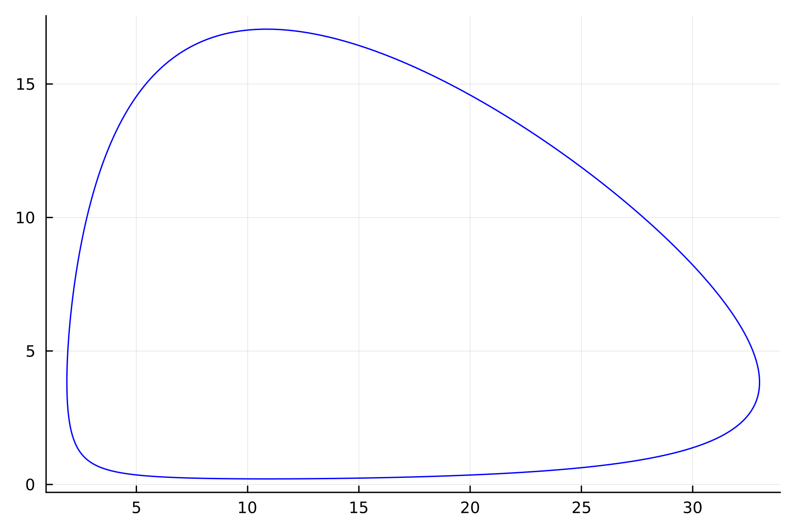
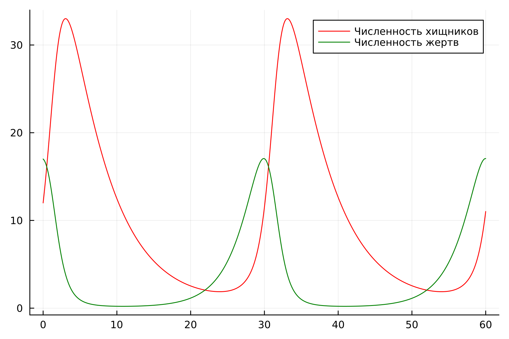
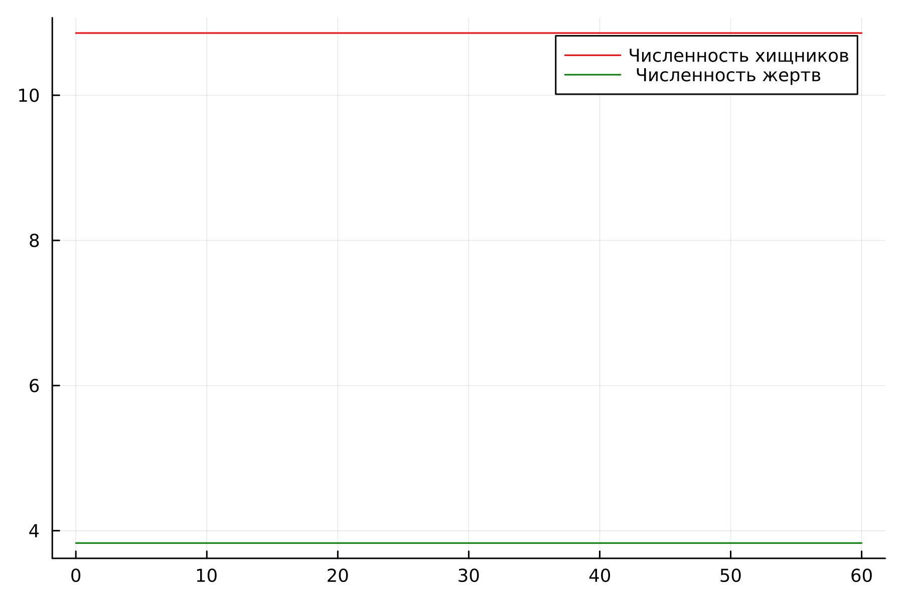
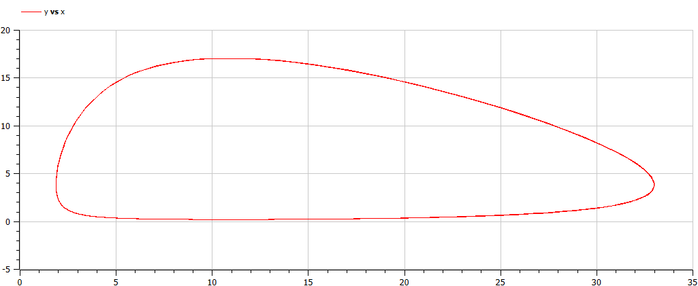
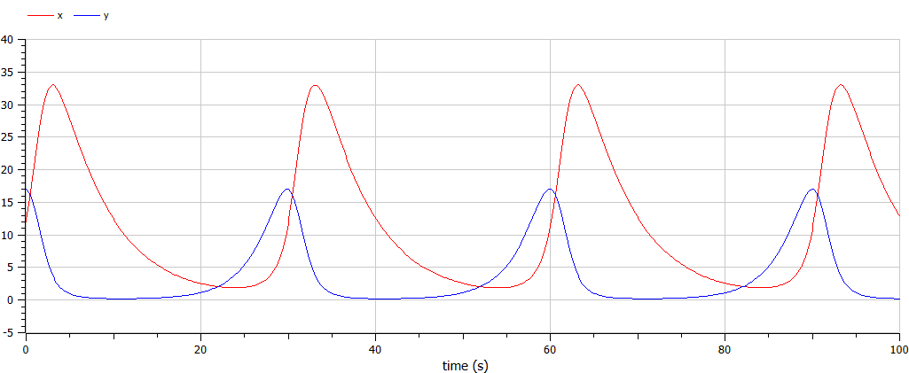
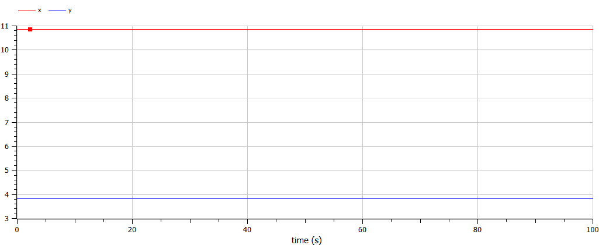

---
## Front matter
lang: ru-RU
title: Лабораторная Работа №5. Модель хищник-жертва
subtitle: Математическое моделирование
author:
  - Боровиков Д.А.
institute:
  - Российский университет дружбы народов им. Патриса Лумумбы, Москва, Россия

## i18n babel
babel-lang: russian
babel-otherlangs: english

## Formatting pdf
toc: false
toc-title: Содержание
slide_level: 2
aspectratio: 169
section-titles: true
theme: metropolis
header-includes:
 - \metroset{progressbar=frametitle,sectionpage=progressbar,numbering=fraction}
 - '\makeatletter'
 - '\beamer@ignorenonframefalse'
 - '\makeatother'

## Fonts
mainfont: Arial
romanfont: Arial
sansfont: Arial
monofont: Arial
---

## Докладчик

  * Боровиков Даниил Александрович
  * НПИбд-01-22
  * Российский университет дружбы народов
  * [1132222006@pfur.ru]

## Цели и задачи

Изучить жесткую модель хищник-жертва и построить эту модель.

## Задание

$$
 \begin{cases}
	\frac{dx}{dt} = -0.18x(t) + 0.047y(t)x(t)
	\\   
	\frac{dy}{dt} = 0.38y(t) - 0.035y(t)x(t)
 \end{cases}
$$

## Julia

{#fig:001 width=70%}

## Julia

{#fig:002 width=60%}

## Julia

{#fig:003 width=70%}

## OpenModelica

{#fig:004 width=60%}

## OpenModelica

{#fig:005 width=70%}

## OpenModelica

{#fig:006 width=60%}

## Вывод

В ходе выполнения лабораторной работы была изучена модель хищник-жертва и построена модель на языках Julia и Open Modelica.

