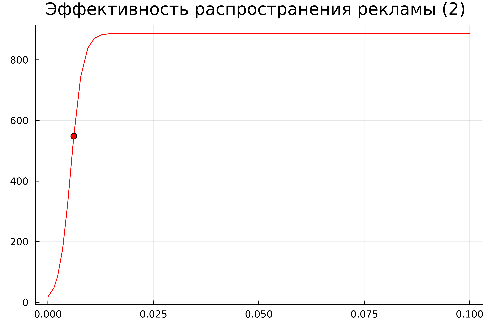

---
## Front matter
lang: ru-RU
title: Лабораторная Работа №7. Модель эффективности рекламы
subtitle: Математическое моделирование
author:
  - Боровиков Д.А.
institute:
  - Российский университет дружбы народов им. Патриса Лумумбы, Москва, Россия

## i18n babel
babel-lang: russian
babel-otherlangs: english

## Formatting pdf
toc: false
toc-title: Содержание
slide_level: 2
aspectratio: 169
section-titles: true
theme: metropolis
header-includes:
 - \metroset{progressbar=frametitle,sectionpage=progressbar,numbering=fraction}
 - '\makeatletter'
 - '\beamer@ignorenonframefalse'
 - '\makeatother'

## Fonts
mainfont: Arial
romanfont: Arial
sansfont: Arial
monofont: Arial
---

## Докладчик

  * Боровиков Даниил Александрович
  * НПИбд-01-22
  * Российский университет дружбы народов
  * [1132222006@pfur.ru]

## Цели и задачи

Изучить и построить модель эффективности рекламы.

## Задание

Постройте график распространения рекламы, математическая модель которой описывается следующим уравнением:

1.	$\frac{dn}{dt} = (0.81 + 0.0003n(t))(N-n(t))$
2.	$\frac{dn}{dt} = (0.00008 + 0.8n(t))(N-n(t))$
3.	$\frac{dn}{dt} = (0.8\sin{t} + 0.8\cos{t} * n(t))(N-n(t))$

При этом объем аудитории $N = 888$, в начальный момент о товаре знает 18 человек.

## При $\alpha _1(t) >> \alpha _2(t)$

{#fig:001 width=70%}

## В обратном случае $\alpha _1(t) << \alpha _2(t)$

{#fig:002 width=60%}

## Julia

{#fig:003 width=70%}

## Julia

{#fig:004 width=60%}

## Julia

{#fig:005 width=70%}

## Вывод

В ходе выполнения лабораторной работы была изучена модель эффективности рекламы и в дальнейшем построена модель на языке Julia.
