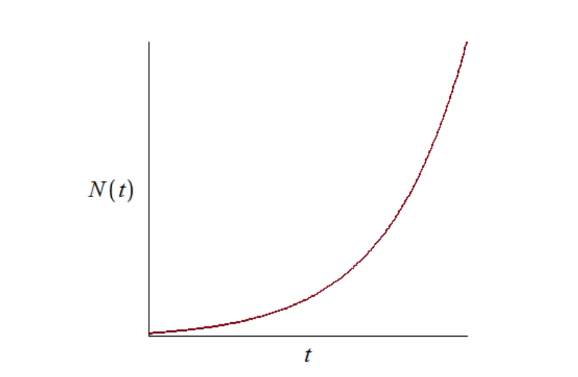
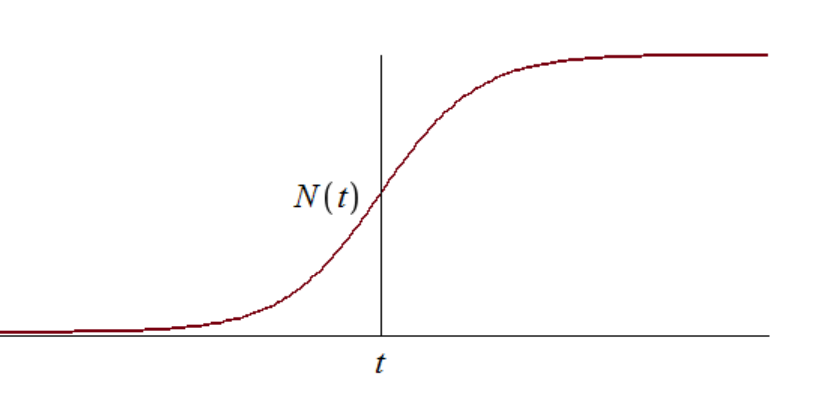
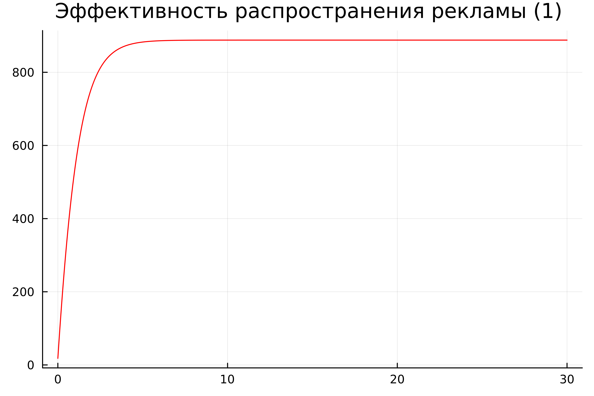
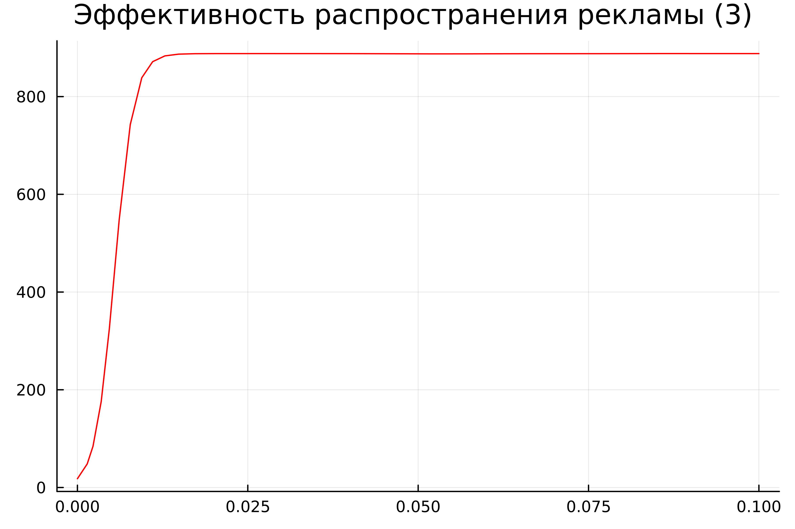

---
## Front matter
title: "Отчёт по лабораторной работе №7"
subtitle: "Дисциплина: Математическое моделирование"
author: "Боровиков Даниил Александрович НПИбд-01-22"

## Generic otions
lang: ru-RU
toc-title: "Содержание"

## Bibliography
bibliography: bib/cite.bib
csl: pandoc/csl/gost-r-7-0-5-2008-numeric.csl

## Pdf output format
toc: true # Table of contents
toc-depth: 2
lof: true # List of figures
lot: true # List of tables
fontsize: 12pt
linestretch: 1.5
papersize: a4
documentclass: scrreprt
## I18n polyglossia
polyglossia-lang:
  name: russian
polyglossia-otherlangs:
  name: english
## I18n babel
babel-lang: russian
babel-otherlangs: english
## Fonts
mainfont: Arial
romanfont: Arial
sansfont: Arial
monofont: Arial
mainfontoptions: Ligatures=TeX
romanfontoptions: Ligatures=TeX
sansfontoptions: Ligatures=TeX,Scale=MatchLowercase
monofontoptions: Scale=MatchLowercase,Scale=0.9
## Biblatex
biblatex: true
biblio-style: "gost-numeric"
biblatexoptions:
  - parentracker=true
  - backend=biber
  - hyperref=auto
  - language=auto
  - autolang=other*
  - citestyle=gost-numeric
## Pandoc-crossref LaTeX customization
figureTitle: "Рис."
tableTitle: "Таблица"
listingTitle: "Листинг"
lofTitle: "Список иллюстраций"
lotTitle: "Список таблиц"
lolTitle: "Листинги"
## Misc options
indent: true
header-includes:
  - \usepackage{indentfirst}
  - \usepackage{float} # keep figures where there are in the text
  - \floatplacement{figure}{H} # keep figures where there are in the text
---

# Цель работы

Изучить и построить модель эффективности рекламы.

# Теоретическое введение. Построение математической модели.

Организуется рекламная кампания нового товара или услуги. Необходимо, чтобы прибыль будущих продаж с избытком покрывала издержки на рекламу. Вначале расходы могут превышать прибыль, поскольку лишь малая часть потенциальных покупателей будет информирована о новинке. Затем, при увеличении числа продаж, возрастает и прибыль, и, наконец, наступит момент, когда рынок насытиться, и рекламировать товар станет бесполезным. [@wiki:bash]

Предположим, что торговыми учреждениями реализуется некоторая продукция, о которой в момент времени $t$ из числа потенциальных покупателей $N$ знает лишь $n$ покупателей. Для ускорения сбыта продукции запускается реклама по радио, телевидению и других средств массовой информации. После запуска рекламной кампании информация о продукции начнет распространяться среди потенциальных покупателей путем общения друг с другом. Таким образом, после запуска рекламных объявлений скорость изменения числа знающих о продукции людей пропорциональна как числу знающих о товаре покупателей, так и числу покупателей о нем не знающих

Модель рекламной кампании описывается следующими величинами.
Считаем, что $\frac{dn}{dt}$ - скорость изменения со временем числа потребителей, узнавших о товаре и готовых его купить,
$t$ - время, прошедшее с начала рекламной кампании,
$N$ - общее число потенциальных платежеспособных покупателей,
$n(t)$ - число  уже информированных клиентов.
Эта величина пропорциональна числу покупателей, еще не знающих о нем, это описывается следующим образом
$\alpha _1(t)(N-n(t))$, где $\alpha _1>0$ -  характеризует интенсивность рекламной кампании (зависит от затрат на рекламу в данный момент времени).
Помимо этого, узнавшие о товаре потребители также распространяют полученную информацию среди потенциальных покупателей, не знающих о нем (в этом случае работает т.н. сарафанное радио). Этот вклад в рекламу описывается величиной  $\alpha _2(t)n(t)(N-n(t))$. эта величина увеличивается с увеличением потребителей узнавших о товаре.

Математическая модель распространения рекламы описывается уравнением:

$$\frac{dn}{dt} = (\alpha _1(t) + \alpha _2(t)n(t))(N-n(t))$$

При $\alpha _1(t) >> \alpha _2(t)$ получается модель типа модели Мальтуса, решение которой имеет вид 

{ #fig:001 width=70% height=70% }

В обратном случае $\alpha _1(t) << \alpha _2(t)$ получаем уравнение логистической кривой

{ #fig:002 width=70% height=70% }

# Задание

**Вариант 7**

Постройте график распространения рекламы, математическая модель которой описывается следующим уравнением:

1.	$\frac{dn}{dt} = (0.81 + 0.0003n(t))(N-n(t))$
2.	$\frac{dn}{dt} = (0.00008 + 0.8n(t))(N-n(t))$
3.	$\frac{dn}{dt} = (0.8\sin{t} + 0.8\cos{t} * n(t))(N-n(t))$

При этом объем аудитории $N = 888$, в начальный момент о товаре знает 18 человек.

Для случая 2 определите в какой момент времени скорость распространения рекламы будет иметь максимальное значение.

# Выполнение лабораторной работы

## Решение с помощью программы Julia

 

Код программы для первого случая $\frac{dn}{dt} = (0.81 + 0.0003n(t))(N-n(t))$

```
using Plots
using DifferentialEquations

N = 888
n0 = 18

function ode_fn(du, u, p, t)
    (n) = u
    du[1] = (0.81 + 0.0003*u[1])*(N - u[1])
end

v0 = [n0]
tspan = (0.0, 30.0)
prob = ODEProblem(ode_fn, v0, tspan)
sol = solve(prob, dtmax = 0.05)
n = [u[1] for u in sol.u]
T = [t for t in sol.t]

plt = plot(
  dpi = 600,
  title = "Эффективность распространения рекламы (1) ",
  legend = false)
plot!(
  plt,
  T,
  n,
  color = :red)

savefig(plt, "lab7_julia_1.png")

```

Код программы для второго случая $\frac{dn}{dt} = (0.00008 + 0.8n(t))(N-n(t))$

```
using Plots
using DifferentialEquations

N = 888
n0 = 18

function ode_fn(du, u, p, t)
    (n) = u
    du[1] = (0.00008 + 0.8*u[1])*(N - u[1])
end

v0 = [n0]
tspan = (0.0, 0.1)
prob = ODEProblem(ode_fn, v0, tspan)
sol = solve(prob)
n = [u[1] for u in sol.u]
T = [t for t in sol.t]

max_dn = 0;
max_dn_t = 0;
max_dn_n = 0;
for (i, t) in enumerate(T)
    if sol(t, Val{1})[1] > max_dn
        global max_dn = sol(t, Val{1})[1]
        global max_dn_t = t
        global max_dn_n = n[i]
    end
end

plt = plot(
  dpi = 600,
  title = "Эффективность распространения рекламы (2) ",
  legend = false)
plot!(
  plt,
  T,
  n,
  color = :red)
plot!(
  plt,
  [max_dn_t],
  [max_dn_n],
  seriestype = :scatter,
  color = :red)

savefig(plt, "lab7_julia_2.png")

```

Код программы для третьего случая $\frac{dn}{dt} = (0.8\sin{t} + 0.8\cos{t} * n(t))(N-n(t))$


```
using Plots
using DifferentialEquations

N = 888
n0 = 18

function ode_fn(du, u, p, t)
    (n) = u
    du[1] = (0.8*sin(8*t) + 0.8*cos(t)*u[1])*(N - u[1])
end

v0 = [n0]
tspan = (0.0, 0.1)
prob = ODEProblem(ode_fn, v0, tspan)
sol = solve(prob, dtmax = 0.05)
n = [u[1] for u in sol.u]
T = [t for t in sol.t]

plt = plot(
  dpi = 600,
  title = "Эффективность распространения рекламы (3) ",
  legend = false)
plot!(
  plt,
  T,
  n,
  color = :red)

savefig(plt, "lab7_julia_3.png")

```

## Результаты работы кода на Julia

{ #fig:003 width=70% height=70% }

{ #fig:004 width=70% height=70% }

{ #fig:005 width=70% height=70% }


# Вывод

В ходе выполнения лабораторной работы была изучена модель эффективности рекламы и в дальнейшем построена модель на языке Julia.


# Список литературы{.unnumbered}

::: {#refs}
:::
