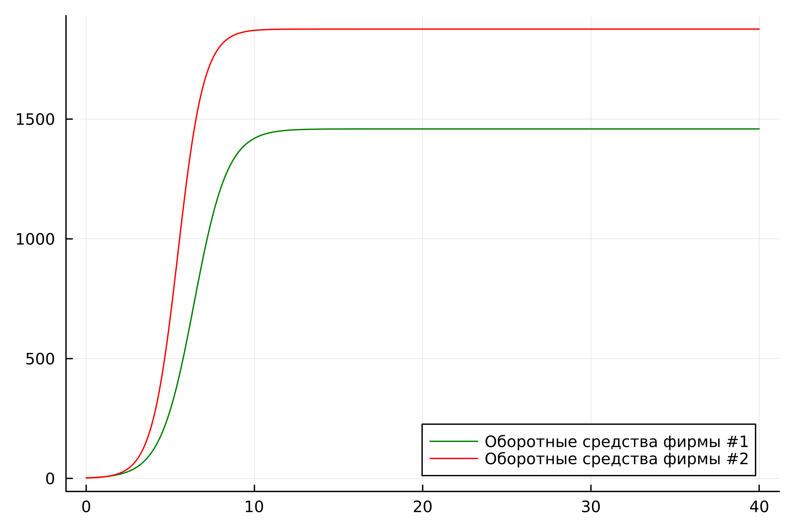
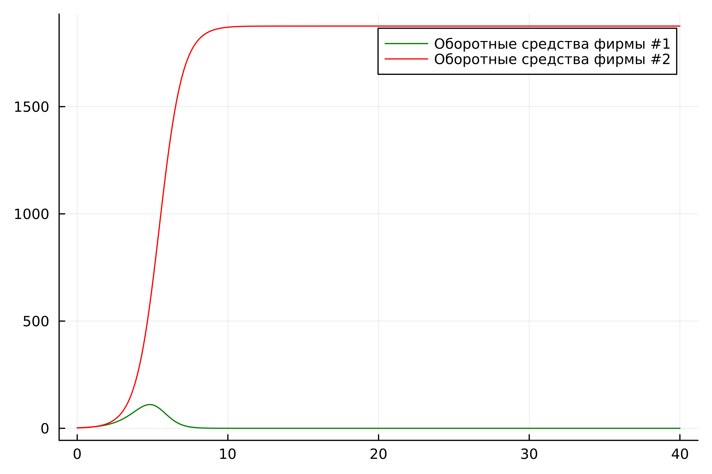

---
## Front matter
lang: ru-RU
title: Лабораторная Работа №8. Модель конкуренции фирм
subtitle: Математическое моделирование
author:
  - Боровиков Д.А.
institute:
  - Российский университет дружбы народов им. Патриса Лумумбы, Москва, Россия

## i18n babel
babel-lang: russian
babel-otherlangs: english

## Formatting pdf
toc: false
toc-title: Содержание
slide_level: 2
aspectratio: 169
section-titles: true
theme: metropolis
header-includes:
 - \metroset{progressbar=frametitle,sectionpage=progressbar,numbering=fraction}
 - '\makeatletter'
 - '\beamer@ignorenonframefalse'
 - '\makeatother'

## Fonts
mainfont: Arial
romanfont: Arial
sansfont: Arial
monofont: Arial
---

## Докладчик

  * Боровиков Даниил Александрович
  * НПИбд-01-22
  * Российский университет дружбы народов
  * [1132222006@pfur.ru]

## Цели и задачи

Изучить и построить модель конкуренции двух фирм.

## Задание 1

$$\frac{dM_1}{d\Theta} = M_1 - \frac{b}{c_1}M_1 M_2 - \frac{a1}{c1} M_1^2 $$
$$ \frac{dM_2}{d\Theta} = \frac{c_2}{c_1} M_2 - \frac{b}{c_1} M_1 M_2 - \frac{a_2}{c_1} M_2^2$$ 
$$ a_1 = \frac{p_{cr}}{\tau_1^2 \widetilde{p}_1^2 Nq } $$
$$ a_2 = \frac{p_{cr}}{\tau_2^2 \widetilde{p}_2^2 Nq } $$ 
$$ b = \frac{p_{cr}}{\tau_1^2 \widetilde{p}_1^2 \tau_2^2 \widetilde{p}_2^2 Nq} $$
$$ c_1 = \frac{p_{cr} - \widetilde{p}_1}{\tau_1 \widetilde{p}_1} $$

## Задание 2

$$\frac{dM_1}{d\Theta} = M_1 - (\frac{b}{c_1} + 0.0016)M_1 M_2 - \frac{a1}{c1} M_1^2 $$
$$ \frac{dM_2}{d\Theta} = \frac{c_2}{c_1} M_2 - \frac{b}{c_1} M_1 M_2 - \frac{a_2}{c_1} M_2^2$$
Для обоих случаев рассмотрим задачу со следующими начальными условиями и параметрами
$$ M_0^1=2.4 \: M_0^2=1.7 $$
$$ p_{cr}=19 \: N=22 \: q=1 $$
$$ \tau_1= 15\: \tau_2=18 $$
$$ \widetilde{p}_1=12 \: \widetilde{p}_2=10 $$

## График 1

{#fig:001 width=70%}

## График 2

{#fig:002 width=60%}

## Вывод

В ходе выполнения лабораторной работы была изучена модель конкуренции двух фирм и в дальнейшем построена модель на языке Julia.
